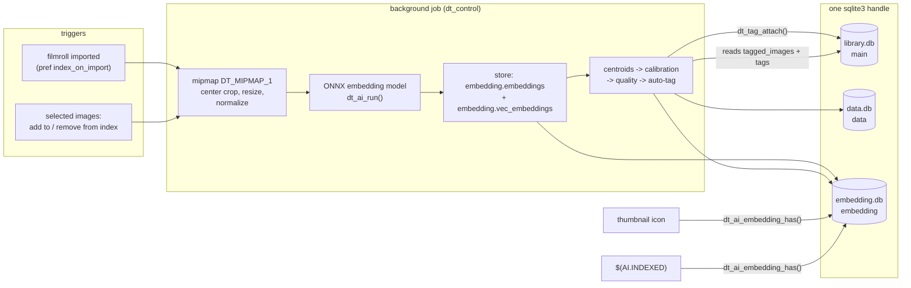
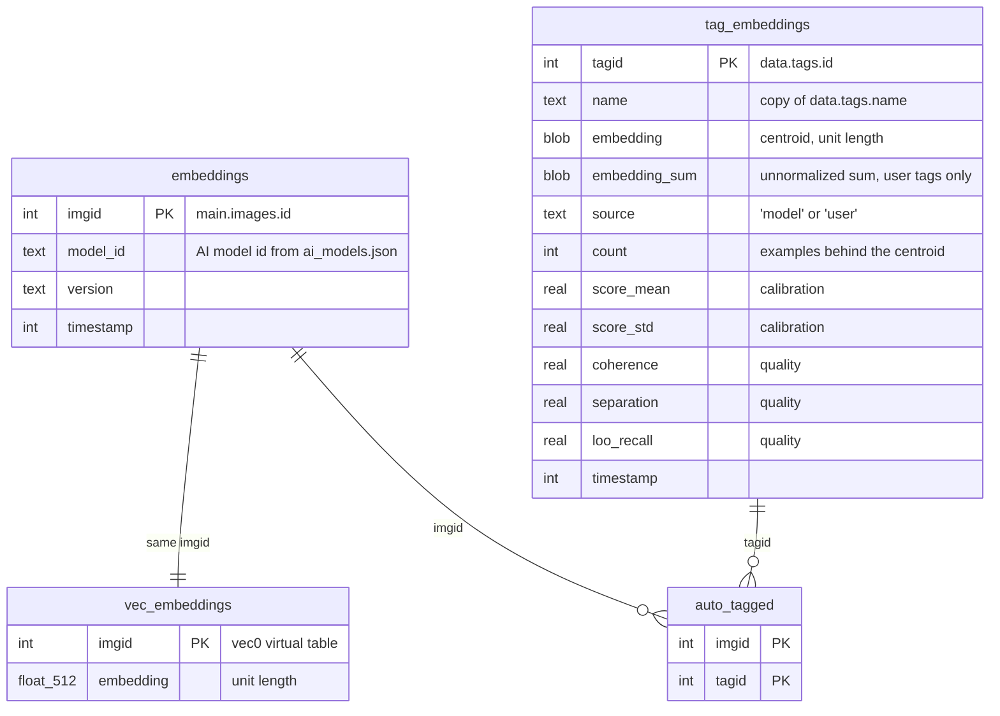
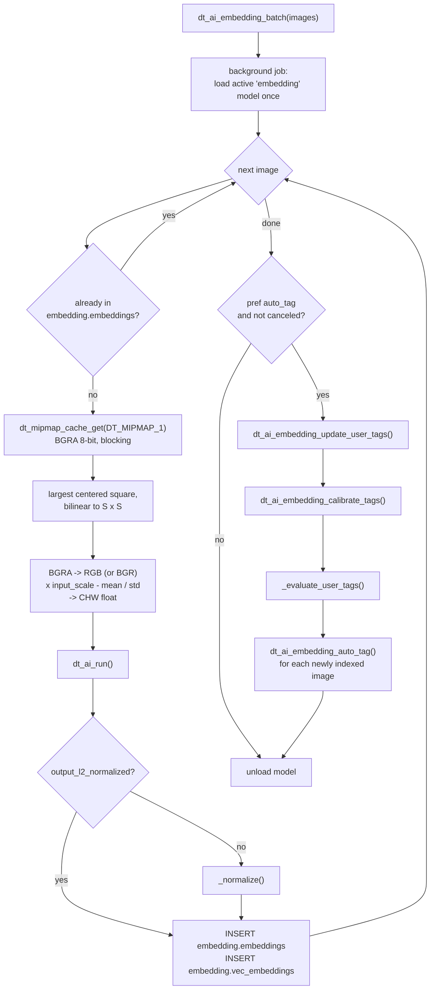
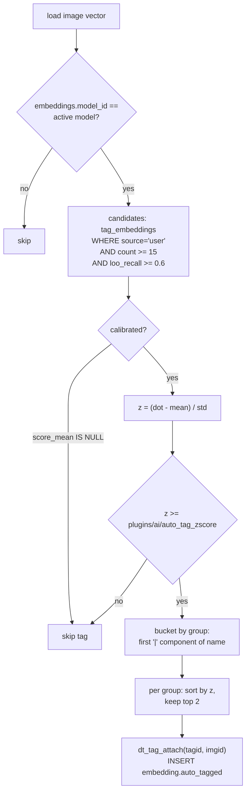

# Image Embeddings and Auto-Tagging

This guide covers the embedding index: how darktable turns each image
into a CLIP-style vector, where those vectors live, and how they drive
automatic tagging from the user's own tags.

See [AI.md](AI.md) for the ONNX backend, model registry and execution
providers. Everything here sits on top of that.

**Task key**: `"embedding"`
**API**: `src/common/ai/embedding.h`
**Consumers**: `src/libs/image.c` (index buttons), `src/dtgtk/thumbnail.c`
(index icon), `src/common/variables.c` (`$(AI.INDEXED)`)

---

## Architecture Overview

```
src/common/ai/embedding.c/.h    the whole subsystem: vector DB lifecycle,
                                 preprocessing, inference, tag centroids,
                                 calibration, auto-tagging, background job
src/external/sqlite-vec/         vendored sqlite-vec (git submodule), compiled
                                 into libdarktable as a static SQLite extension
src/ai/backend.h                 dt_ai_model_attribute_double_array(), added so
                                 preprocessing constants come from config.json
data/ai_models.json              catalog entry for the default embedding model
data/darktableconfig.xml.in      the three plugins/ai/* preferences
```



The design has one deliberate asymmetry: image embeddings are
expensive (one inference each) and are treated as durable data.
Everything derived from them, centroids and statistics, is cheap and is
recomputed wholesale at the end of every indexing batch.

---

## Build

sqlite-vec is a git submodule at `src/external/sqlite-vec` and is
compiled straight into `lib_darktable` next to `embedding.c`, not
loaded as a runtime `.so`. `src/CMakeLists.txt` generates `sqlite-vec.h`
from the upstream template, defines `SQLITE_CORE` and
`SQLITE_VEC_STATIC` for that one translation unit, and disables `-Werror`
on it because upstream does not compile clean under darktable's warning
set.

The entire subsystem is behind `HAVE_AI`. Every call site outside
`embedding.c` is wrapped in `#ifdef HAVE_AI`, and the model is fetched
through the normal model registry, so a build without AI has no
sqlite-vec, no `embedding.db` and no index buttons.

---

## The Vector Database

### Attachment and lifecycle

darktable has a single `sqlite3 *` handle with `library.db` open as
`main` and `data.db` attached as `data`. `dt_ai_embedding_init()`,
called from `dt_init()` once signals exist, adds a third file:

1. `sqlite3_vec_init()` registers the `vec0` virtual table module on
   that handle. This must happen before the attach, or the virtual
   table cannot be opened
2. `embedding.db` in the user config directory (next to `library.db`)
   is `ATTACH`ed as `embedding`
3. the version row in `embedding.db_info` is read and `_upgrade_embed_schema()`
   brings it to `EMBED_DB_VERSION`
4. model tags are imported from the active model's `tags.json`
5. the `DT_SIGNAL_FILMROLLS_IMPORTED` handler is connected

If any step fails, the database is detached and `_embed_attached` stays
`FALSE`. Every public `dt_ai_embedding_*` function checks that flag first
and returns a no-op result, so the rest of darktable never has to know
whether the index exists. Code outside `embedding.c` should call that
API rather than name `embedding.*` tables in its own SQL.

Because it is one handle, every statement in the file joins freely
across `main`, `data` and `embedding`. The trade-off is that SQLite does
not enforce foreign keys across attached databases: the `imgid` and
`tagid` columns in `embedding.*` are conventions kept by C code.

`dt_ai_embedding_cleanup()` disconnects the signal and detaches.

### Schema



| Table | Holds | Why it is separate |
|-------|-------|--------------------|
| `vec_embeddings` | the 512-float vector per image, in a sqlite-vec `vec0` table | `vec0` stores only a rowid and the vector; it is the future home of KNN queries |
| `embeddings` | per-image metadata: which model, when | `vec0` cannot carry extra columns, and `model_id` is needed to refuse cross-model comparisons |
| `tag_embeddings` | one centroid per tag plus its calibration and quality numbers | fully derived, cheap to rebuild |
| `auto_tagged` | (image, tag) pairs darktable attached itself | keeps machine output out of the training set, see below |

`embeddings` and `vec_embeddings` are always written together in
`_store_embedding()` and deleted together in `dt_ai_embedding_remove()`.
Treat them as one logical row.

### How the vectors are actually queried

Today no statement uses sqlite-vec's `MATCH` / KNN operator. Vectors
are read back as blobs with plain `SELECT` and the cosine similarity is
a dot product in C. This works because every stored vector is unit
length, so cosine equals dot product. sqlite-vec is present for storage
and for the similarity search that the model card promises but which
has no UI yet.

### Versioning

`EMBED_DB_VERSION` is stored as the `version` row of `embedding.db_info`,
the same key-value table `library.db` and `data.db` use, and
`_upgrade_embed_schema()` migrates step by step, in the same style as
`database.c`. A database newer than the build is refused and detached.

While the schema is still moving, `_dev_ensure_tag_table_shape()`
drops and recreates `tag_embeddings` whenever it lacks the newest
column, without a version bump. This is safe only because that table is
derived; the next batch repopulates it. Image embeddings are never
touched by this path. The function is marked to be removed when the
schema freezes, at which point every change goes through a version
step.

---

## Model Requirements

### Tensors

| Tensor | Shape | Type | Notes |
|--------|-------|------|-------|
| Input 0 | `[1, 3, S, S]` | float32 | CHW, `S` from `input_sizes` in `config.json` |
| Output 0 | `[1, 512]` | float32 | `DT_AI_EMBED_DIM`; any other width is rejected at runtime |

The output width is a compile-time constant. `dt_ai_run()` writes into
a fixed `float[512]` and reports the runtime shape back; a model with a
different width is detected and refused before its output is stored,
but changing the width means changing `DT_AI_EMBED_DIM` and the `vec0`
declaration together, plus a schema version step.

### `config.json` attributes

Preprocessing is not hard-coded. `_resolve_preproc()` reads these
attributes from the model manifest, with defaults matching OpenCLIP:

| Attribute | Type | Default | Meaning |
|-----------|------|---------|---------|
| `input_sizes` | int array | `[224]` | square input edge; only the first entry is used |
| `color_space` | string | `"rgb"` | `"bgr"` swaps channel order |
| `input_scale` | double | `1/255` | multiplier applied to the 8-bit value before mean/std |
| `norm_mean` | double[3] | `[0,0,0]` | subtracted after scaling |
| `norm_std` | double[3] | `[1,1,1]` | divided after mean subtraction |
| `output_l2_normalized` | bool | `true` | if `false`, darktable normalizes the output itself |

`dt_ai_model_attribute_double_array()` was added to `backend.h` for
`norm_mean` and `norm_std`; it mirrors the existing int-array accessor.

### `tags.json`

An optional file in the model directory carrying pre-computed text
embeddings for a fixed taxonomy:

```json
{
  "tags":       ["genre|landscape", "genre|portrait", "subject|animal|dog", ...],
  "embeddings": [[0.012, -0.031, ...], [...], ...]
}
```

Both arrays must have the same length and each vector must have 512
entries (extra entries are ignored, missing ones are zero). Tag names
use darktable's `|` hierarchy, and the first component is the tag's
*group*, which matters for auto-tagging. On every start
`_import_model_tags()` creates these tags in `data.tags` with
`dt_tag_new()` and inserts the vectors as `source='model'` rows with
`INSERT OR IGNORE`, so they never overwrite a user centroid.

The shipped model is OpenCLIP RN101 trained on YFCC15M, chosen because
it is the one widely available CLIP dataset built from
Creative-Commons-licensed photos. Its `tags.json` has 86 tags.

---

## Indexing Pipeline



Points that are easy to get wrong:

- **The source is the thumbnail, not the pipeline.** `DT_MIPMAP_1`
  (360x225) is far above the model's input size and is already
  rendered with the image's history, so indexing costs no pixelpipe
  run. It also means re-editing an image does not change its embedding
  unless the user re-indexes.
- **Center crop, never squash.** CLIP preprocessing is "resize shortest
  side, then center crop". Sampling the largest centered square and
  scaling it to `S x S` does both in one bilinear pass. Resizing the
  whole frame anamorphically degrades every embedding of a non-square
  photo.
- **Unit length is an invariant.** Every vector in `vec_embeddings` is
  L2-normalized, either by the graph or by `_normalize()`. All later
  math assumes it.
- **One model load per batch.** `dt_ai_embedding_compute()` exists for
  single images and loads and unloads the model around one inference.
  Anything that indexes more than one image must go through
  `dt_ai_embedding_batch()`.
- **`model_id` is recorded with each vector.** Centroids, calibration
  and matching all filter on the active model's id. Vectors from a
  previous model stay in the table but are ignored, not silently mixed
  in.

The batch job reports progress through `dt_control_job_set_progress()`
and honors cancellation between images. A canceled batch keeps the
embeddings it already stored but skips the auto-tag phase.

---

## Tag Centroids

A centroid is the unit-length mean of the embeddings of a tag's
examples. Two kinds exist, distinguished by `source`:

**`'model'`** rows come from `tags.json`. They are text embeddings of
concept names. They get calibrated like every other row, but they are
never auto-applied: image-to-text similarity is a much weaker signal
than image-to-image, and the taxonomy's concepts are generic. Nothing
reads them yet beyond calibration.

**`'user'`** rows are rebuilt from scratch by
`dt_ai_embedding_update_user_tags()` at the end of every batch. For every
tag with at least `TAG_MIN_EXAMPLES` (3) indexed examples it sums the
example vectors, stores the raw sum in `embedding_sum` and the
normalized sum in `embedding`, and records `count`. The query excludes:

- tags under `darktable|` (internal tags)
- images indexed by a different model
- any (image, tag) pair present in `auto_tagged`

The last exclusion is the reason `auto_tagged` exists. If darktable's
own tag assignments fed back into the centroid, the centroid would
drift toward whatever it already predicts and the confidence gate below
would ratchet itself open. Positives are always human-applied.

`embedding_sum` is kept because it is a sufficient statistic: dropping
one example from the mean is a subtraction, which makes the
leave-one-out estimate below O(d) per example instead of a rebuild.

---

## Calibration and Tag Quality

Raw cosine scores are not comparable across tags. A tag that sits near
the middle of the library (say `genre|landscape` in a landscape
photographer's library) has a high similarity to almost everything, so
a fixed cosine threshold would either fire constantly for it or never
for a rare tag. Two passes fix this, both run after the centroids and
both relative to the library as it is *after* the batch.

### `dt_ai_embedding_calibrate_tags()`

Draws `TAG_CALIBRATION_SAMPLE` (500) image vectors with
`ORDER BY random()` and, for every centroid (model and user), computes
the mean and standard deviation of cosine over that sample into
`score_mean` and `score_std`. The sample is random on purpose: a plain
`LIMIT` returns the oldest-indexed images and biases every tag. With
fewer than 16 indexed images the columns stay `NULL`, and a `NULL`
calibration makes a tag ineligible for auto-tagging rather than falling
back to raw cosine.

From then on a match is scored as a z-score:

```
z = (cos(image, centroid) - score_mean) / score_std
```

### `_evaluate_user_tags()`

For each calibrated user tag it walks the human-applied examples and
stores three numbers:

| Column | Meaning |
|--------|---------|
| `coherence` | mean cosine of the examples to their own centroid |
| `separation` | that coherence as a z-score against the library. Compactness alone cannot be the gate: a tag covering most of a library is compact *and* useless |
| `loo_recall` | fraction of examples that would have been recognized by a centroid built from the other examples, at the current z threshold |

`loo_recall` is the number that decides whether a tag is trusted. This
is positive-unlabeled data, since untagged images may well deserve the
tag, so recall is the only estimable quantity here; precision is not.

---

## Auto-Tagging

`dt_ai_embedding_auto_tag(imgid)` runs once per newly indexed image after
the passes above.



Why top-K *per group* rather than globally: the taxonomy's groups are
not mutually exclusive. An image has a genre *and* a subject *and* a
time of day, so `genre|` tags compete only with other `genre|` tags.
This uses `data.tags` naming conventions directly; a user whose tags
are flat gets one group with a top-2 cap.

The attached tag is an ordinary darktable tag in `main.tagged_images`,
indistinguishable from a user tag in the tagging module. Provenance
lives only in `embedding.auto_tagged`.

### Gates and constants

| Constant | Value | Applies to |
|----------|-------|-----------|
| `TAG_MIN_EXAMPLES` | 3 | minimum examples to build a user centroid at all |
| `TAG_MIN_EXAMPLES_APPLY` | 15 | minimum examples before a tag may be auto-applied. Below this the prototype mostly encodes what a handful of photos incidentally share |
| `TAG_MIN_LOO_RECALL` | 0.6 | minimum leave-one-out recall to auto-apply |
| `TAG_ZSCORE_FLOOR` | 1.5 | default z threshold if the preference is unset |
| `TAG_TOP_K_PER_GROUP` | 2 | tags applied per group per image |
| `TAG_CALIBRATION_SAMPLE` | 500 | images sampled for `score_mean` / `score_std` |

| Preference | Default | Effect |
|------------|---------|--------|
| `plugins/ai/index_on_import` | off | index every image of a newly imported film roll |
| `plugins/ai/auto_tag` | off | run the centroid / calibration / apply phase after each batch |
| `plugins/ai/auto_tag_zscore` | 1.5 | z threshold used both for applying and for computing `loo_recall` |

The same z threshold is used in `_evaluate_user_tags()` and in
`dt_ai_embedding_auto_tag()` on purpose: `loo_recall` is meant to estimate
recall at the threshold the user will actually run with.

---

## Public API

| Function | Purpose |
|----------|---------|
| `dt_ai_embedding_init()` / `dt_ai_embedding_cleanup()` | attach and detach `embedding.db`; called from `dt_init()` / `dt_cleanup()` |
| `dt_ai_embedding_has(imgid)` | is this image indexed |
| `dt_ai_embedding_has_any(GList *)` | one query for a whole list; use this on UI refresh paths, never `dt_ai_embedding_has()` in a loop |
| `dt_ai_embedding_get(imgid, &dim)` | copy of the stored vector, caller frees |
| `dt_ai_embedding_compute(imgid)` | index one image, loading and unloading the model around it |
| `dt_ai_embedding_batch(GList *)` | queue the background job for many images |
| `dt_ai_embedding_remove(GList *)` | drop `embeddings` and `vec_embeddings` rows, synchronous |
| `dt_ai_embedding_update_user_tags()` | rebuild every `'user'` centroid |
| `dt_ai_embedding_calibrate_tags()` | recompute `score_mean` / `score_std` for every centroid |
| `dt_ai_embedding_auto_tag(imgid)` | apply tags to one indexed image |

`_evaluate_user_tags()` is file-local and only runs from the batch job,
because its numbers are meaningless before calibration.

---

## UI Integration

- **selected images module** (`src/libs/image.c`): "add to index"
  removes any existing entries for the selection and queues a fresh
  batch, so the button doubles as re-index. "remove from index" calls
  `dt_ai_embedding_remove()`. Button sensitivity uses
  `dt_ai_embedding_has_any()`.
- **thumbnail overlay** (`src/dtgtk/thumbnail.c`): a `w_indexed` icon
  drawn with `dtgtk_cairo_paint_index`, visible when
  `dt_ai_embedding_has()` is true, tooltip "in AI index".
- **variables** (`src/common/variables.c`): `$(AI.INDEXED)` expands to
  `#` for indexed images, empty otherwise, for use in overlay patterns
  and export filenames.
- **preferences**: the three `plugins/ai/*` keys appear under
  lighttable > indexing.
- **import**: `DT_SIGNAL_FILMROLLS_IMPORTED` indexes every image of the
  film roll that is not yet in `embedding.embeddings`, when the preference
  is on.

---

## Known Gaps

These are current limitations of the branch, listed so nobody rebuilds
the design around them by accident:

- **No similarity search UI.** The `vec0` table is populated but no
  KNN query exists yet. When one is added it belongs in `embedding.c`
  behind a `dt_ai_embedding_*` function, using `MATCH` on
  `embedding.vec_embeddings` filtered by `model_id`.
- **Removing an image from the library leaves its index rows.**
  Nothing on the image-removal path calls `dt_ai_embedding_remove()`, and
  cross-database cascades do not exist. `embeddings`, `vec_embeddings`
  and `auto_tagged` accumulate orphans.
- **Switching models needs a manual re-index.** Old vectors are
  ignored, not migrated. There is no prompt telling the user their
  index is stale.
- **Model taxonomy tags are dormant.** `tags.json` centroids are
  imported and calibrated but never surfaced.
- **`tag_embeddings.name` is a copy.** Renaming a tag in `data.tags`
  does not update it. Code keys on `tagid`; treat the name as
  informational.
- **Fixed 512-dimension width.** A model with a different embedding
  width cannot be used without a code change and a schema step.
