# NOVA Architecture

> darktable-nova: a modern webview-based UI for darktable

**Status**: Experimental (branch `nova`)
**Date**: March 2026

---

## 1. System Overview

NOVA is a three-tier architecture that decouples darktable's image processing engine from its user interface.

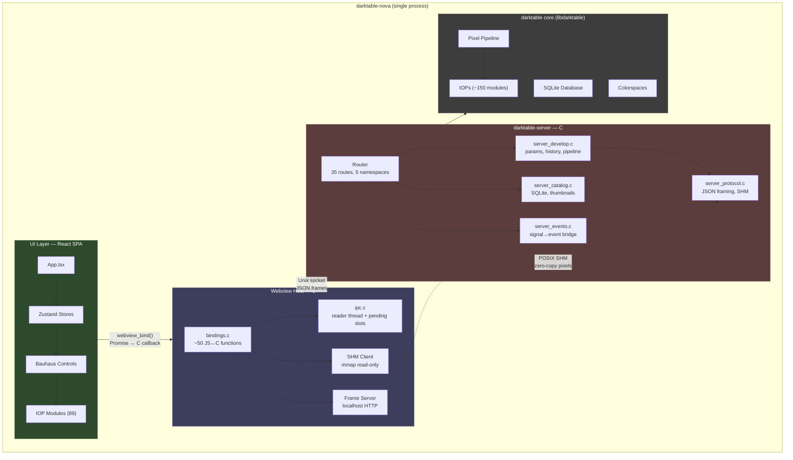

The darktable-nova binary is a **single process** that embeds both the webview host and the darktable server. The server runs on a background thread connected via a Unix domain socket. The webview renders a React SPA and communicates through JS↔C bindings that forward requests over IPC.

---

## 2. Process Lifecycle

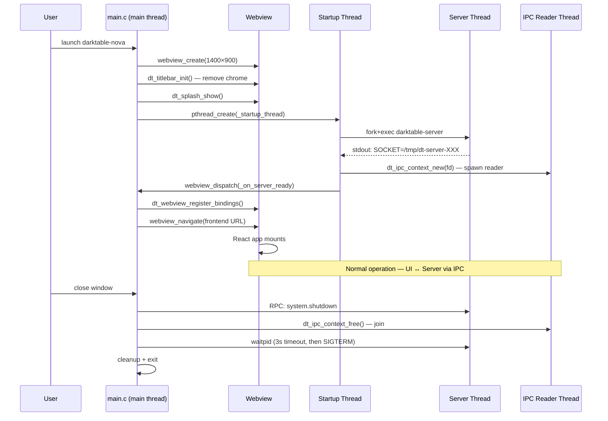

---

## 3. Layer Details

### 3.1 Server Layer (`src/server/`)

| File | Lines | Purpose |
|------|-------|---------|
| `server.h` | 144 | Core types, session struct, route table, handler declarations |
| `server.c` | 405 | Socket listener, accept loop, dispatch, event drain, session lifecycle |
| `server_protocol.h` | 96 | Wire format, SHM structs, error codes, request/response builders |
| `server_protocol.c` | 336 | Length-prefixed JSON framing, request parsing, response serialization |
| `server_develop.c` | 3137 | All develop operations: params, history, pipeline, presets, introspection |
| `server_catalog.c` | ~500 | SQLite queries, thumbnails, import, collections |
| `server_events.c` | ~200 | Signal→event bridge (pipeline done, history changed, etc.) |
| `server_export.c` | ~150 | Image export |
| `main.c` | ~100 | Standalone server entry point (for debugging without webview) |

#### Wire Protocol

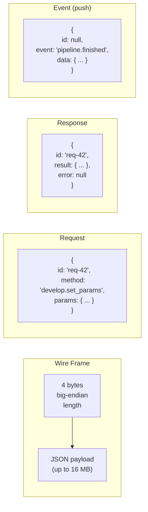

#### API Namespace Map

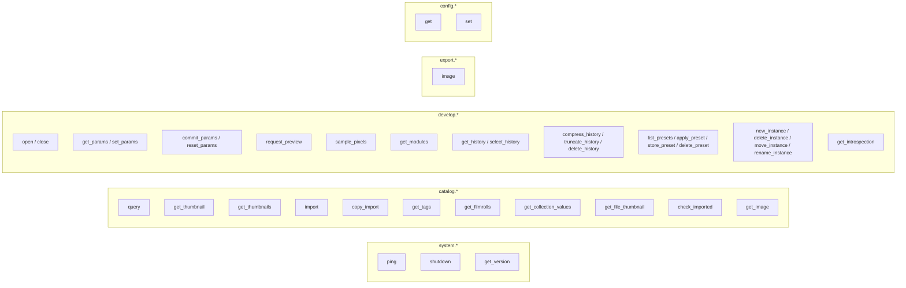

#### Session Model

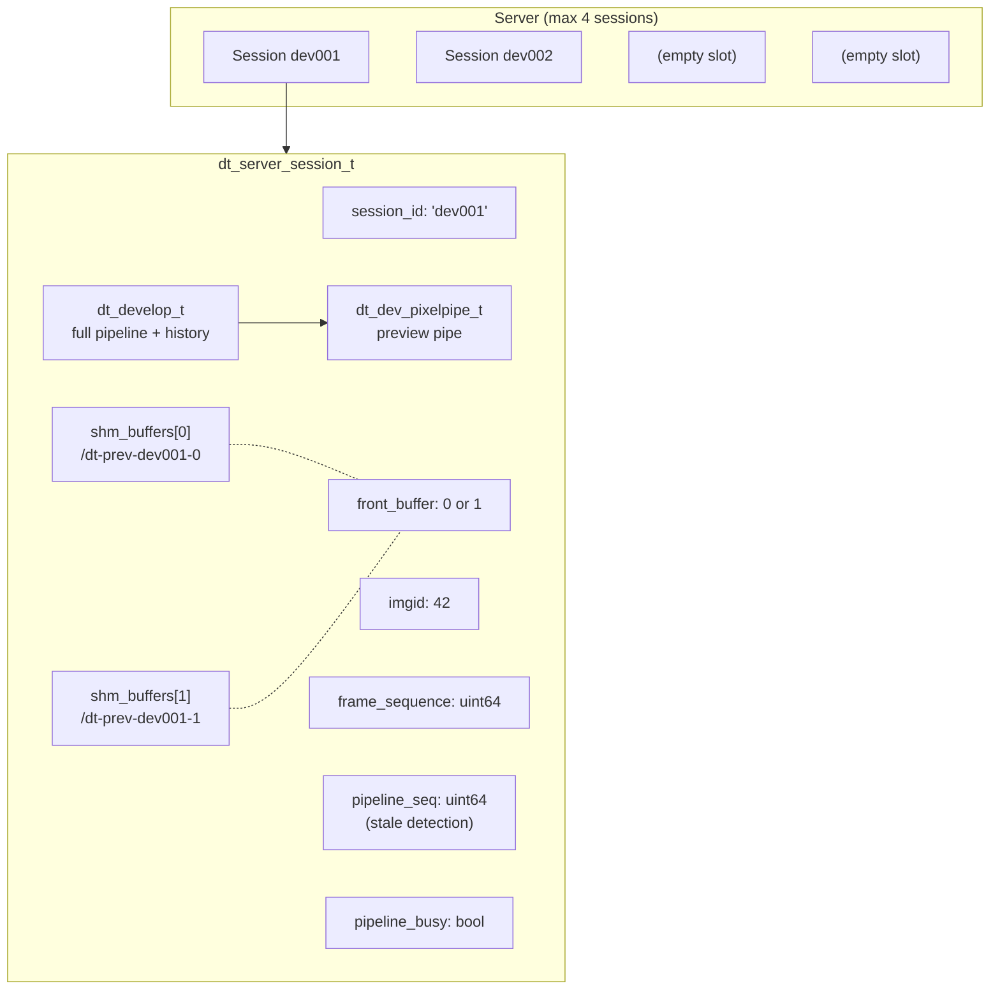

#### Shared Memory Buffer Layout

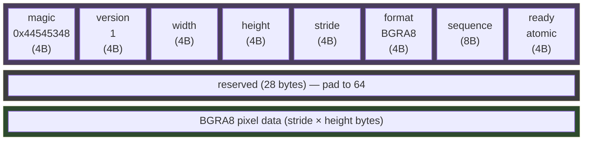

#### Introspection System

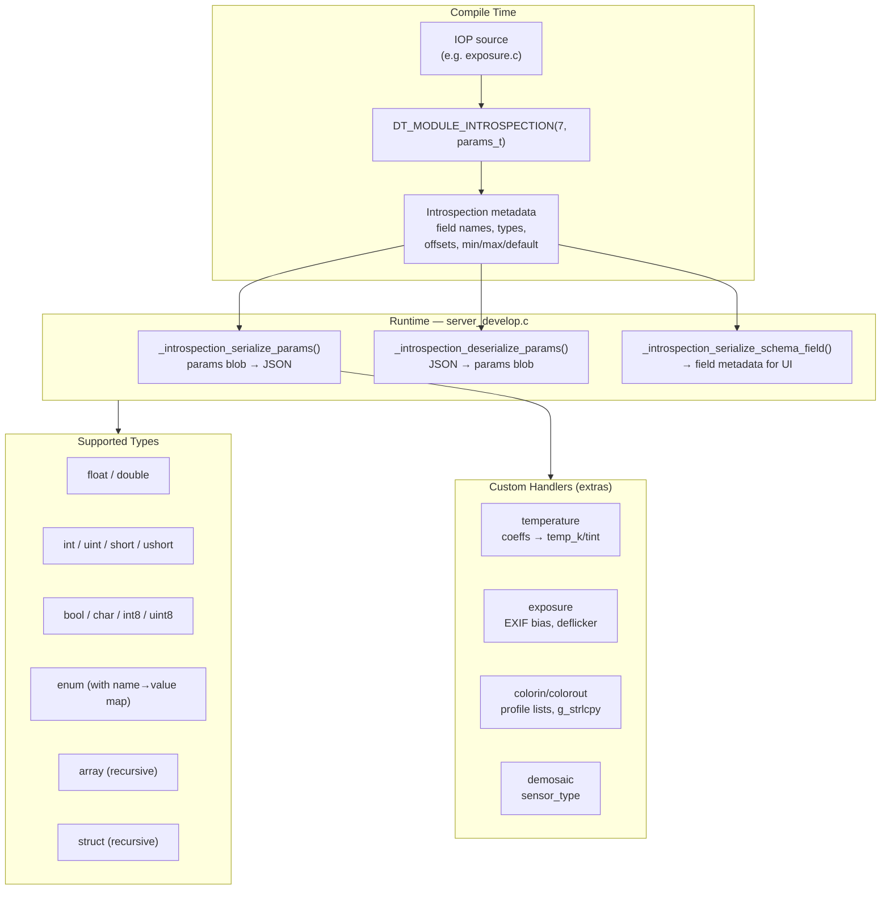

### 3.2 Webview Host Layer (`src/webview/`)

| File | Lines | Purpose |
|------|-------|---------|
| `main.c` | 445 | Process entry, CLI args, server fork/connect, webview init, asset loading |
| `bindings.c` | 2552 | All JS↔C bindings (~50 functions), JSON arg parsing, IPC forwarding |
| `bindings.h` | 65 | Webview context struct, SHM session tracking |
| `ipc.c` | 471 | Socket connect, frame read/write, event reader thread, event dispatch |
| `ipc.h` | ~60 | IPC context type, event callback registration |
| `splash.c` | 157 | Splash screen HTML generation and display |
| `platform/titlebar_macos.m` | ~80 | macOS native titlebar integration (Cocoa) |
| `platform/titlebar_linux.c` | ~40 | Linux titlebar (GTK3 CSD) |
| `platform/titlebar_windows.c` | ~40 | Windows titlebar (DWM) |

#### Binding Execution Flow

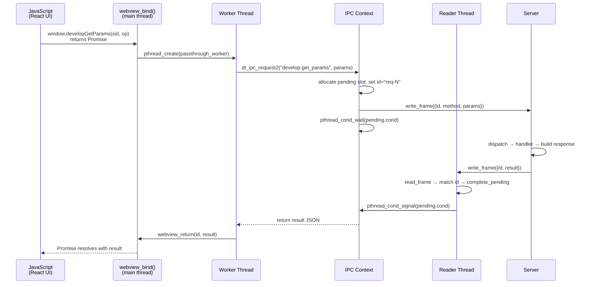

#### IPC Threading Model

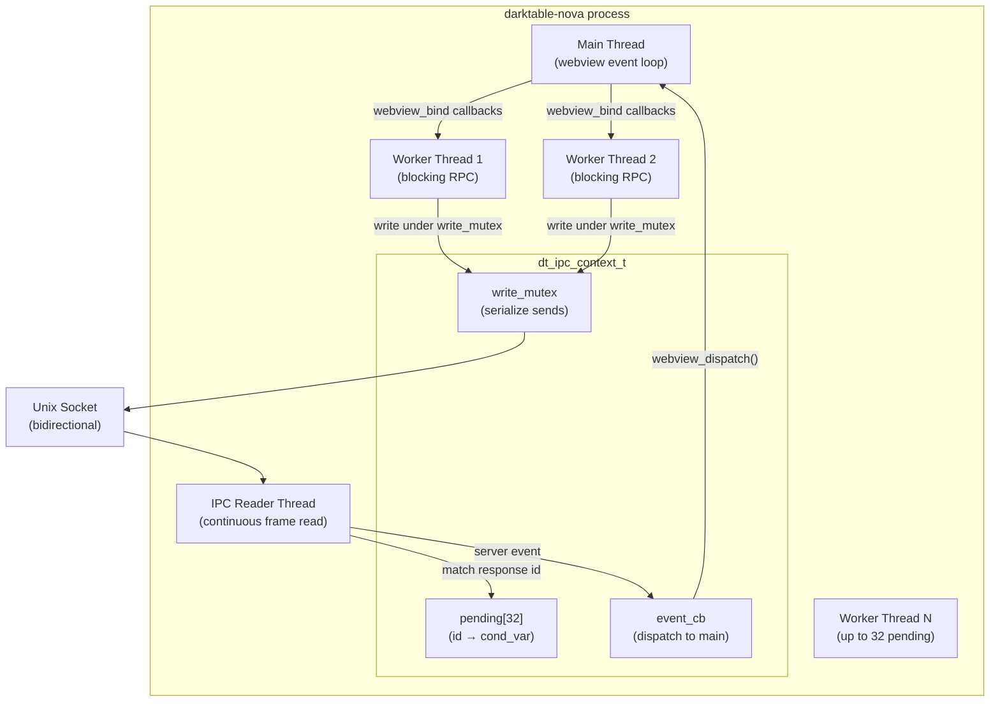

#### Platform Titlebar Strategy

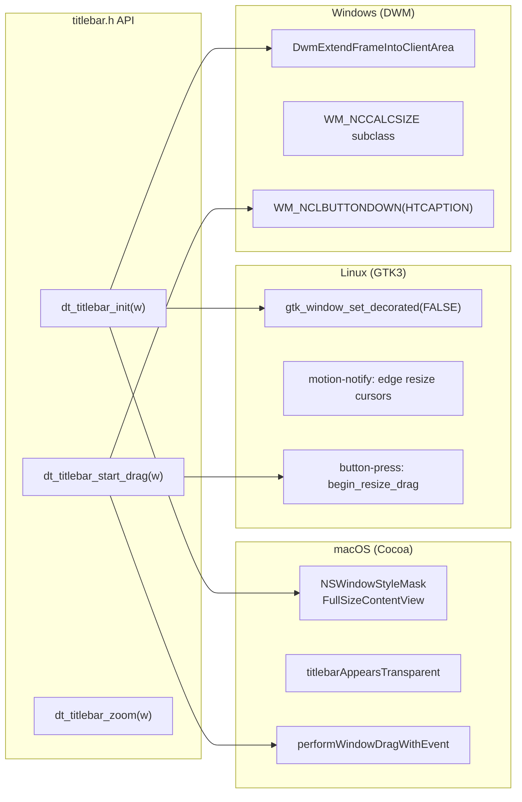

### 3.3 UI Layer (`ui/`)

| Area | Files | Lines | Purpose |
|------|-------|-------|---------|
| Entry | `main.tsx`, `App.tsx` | ~200 | React root, top-level layout routing |
| API bridge | `api/commands.ts` | 189 | Typed wrappers for all `window.*` bindings |
| API events | `api/events.ts` | 29 | `__dt_event` bridge, pub/sub for server events |
| Stores | `stores/*.ts` (9 files) | 1935 | Zustand state management |
| Controls | `controls/*.tsx` (14 files) | ~1500 | Reusable Bauhaus-style widgets |
| IOP modules | `modules/iop/*.tsx` (89 files) | ~8000 | Image operation modules |
| Lib modules | `modules/lib/*.tsx` | ~500 | Library/utility modules |
| Registry | `modules/registry.ts` | ~500 | Module→component mapping, lazy loading |
| Views | `Darkroom/`, `Lighttable/`, etc. | ~3000 | Application views |
| Types | `types/*.ts` | ~400 | Protocol types, collection types |
| Styles | `index.css`, `themes/` | ~800 | Darktable-matching CSS theme |
| **Total** | **~148 .tsx/.ts files** | **~13,700** | |

#### Application Layout

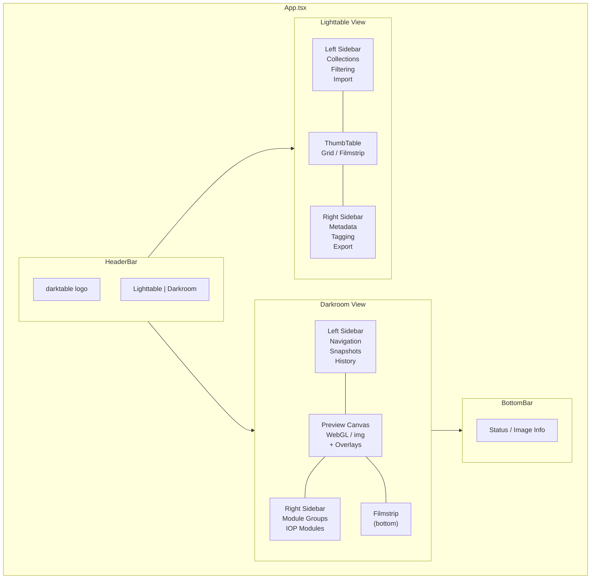

#### Store Architecture

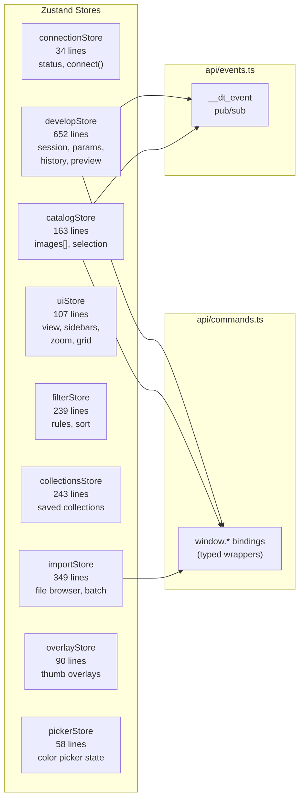

#### Module System

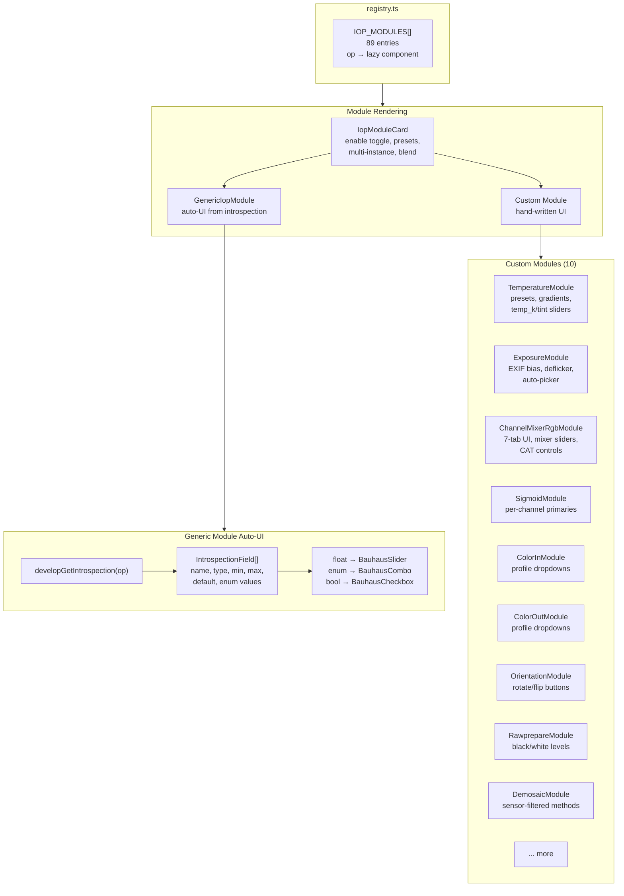

#### Bauhaus Widget Library

```mermaid
graph LR
    subgraph controls["14 Bauhaus Controls"]
        Slider["BauhausSlider<br/>pointer-drag, origin,<br/>gradient, format fn"]
        Combo["BauhausCombo<br/>dropdown, groups,<br/>action icon"]
        Check["BauhausCheckbox<br/>toggle with label"]
        Button["BauhausButton<br/>icon + text"]
        TabBar["BauhausTabBar<br/>generic typed tabs,<br/>overflow ellipsis"]
        Section["BauhausSection<br/>collapsible group"]
        Picker["BauhausPicker<br/>color/area picker"]
        Label["BauhausLabel<br/>read-only display"]
        Input["BauhausInput<br/>numeric input"]
        TextInput["BauhausTextInput<br/>string input"]
        Select["BauhausSelect<br/>native select"]
        Dropdown["BauhausDropdown<br/>portal popup"]
        Row["BauhausRow<br/>horizontal layout"]
        Tooltip["BauhausTooltip<br/>hover info"]
    end

    style Slider fill:#4a3d5c,color:#fff
    style Combo fill:#4a3d5c,color:#fff
    style Check fill:#4a3d5c,color:#fff
    style TabBar fill:#4a3d5c,color:#fff
```

---

## 4. Data Flow

### 4.1 Slider Drag — Preview-Only Mode

```mermaid
sequenceDiagram
    participant User
    participant React as React Component
    participant Store as developStore
    participant Bridge as window.* binding
    participant Bind as bindings.c
    participant Srv as Server
    participant Pipe as Pipeline Worker
    participant SHM as Shared Memory

    User->>React: drag slider
    React->>React: setLocalState(value)
    React->>Store: throttledApply(field, value)
    Store->>Bridge: developSetParams(sid, op, params, previewOnly=true)
    Bridge->>Bind: on_develop_set_params()
    Bind->>Srv: IPC: develop.set_params {preview_only: true}
    Srv->>Srv: write params → module->params
    Srv->>Srv: commit to pipe piece (skip history)
    Srv->>Srv: invalidate pipeline cache
    Srv->>Pipe: bump pipeline_seq, spawn worker

    Pipe->>Pipe: dt_dev_process_image_job()
    Pipe->>SHM: write BGRA8 to back buffer
    Pipe->>SHM: swap front_buffer, set ready=1
    Pipe->>Srv: queue "pipeline.finished" event

    Srv-->>Bind: event: pipeline.finished
    Bind-->>React: window.__dt_event()
    React->>Bridge: getPreviewFrame(sid, frontBuffer)
    Bridge->>Bind: read SHM → JPEG → base64
    Bind-->>React: data:image/jpeg;base64,...
    React->>React: update preview image
```

### 4.2 Slider Release — Commit to History

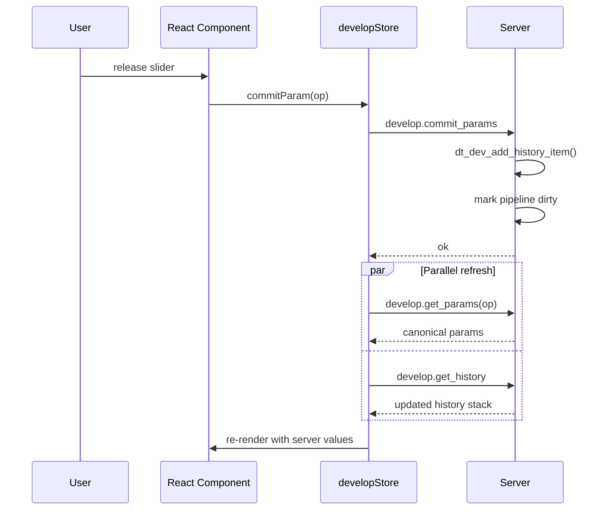

### 4.3 Pipeline Stale Detection

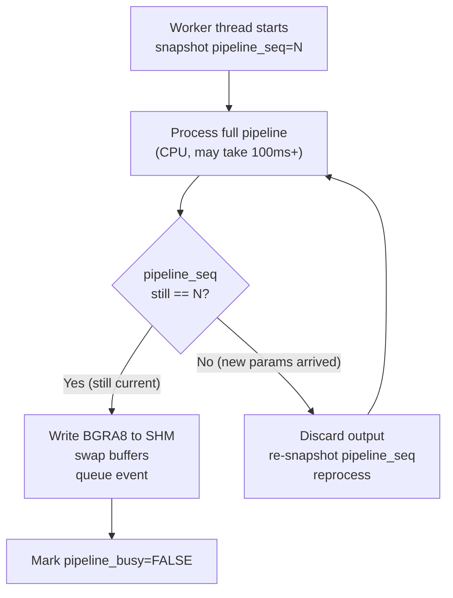

### 4.4 Double-Buffered Preview Frame Delivery

```mermaid
sequenceDiagram
    participant Server as Server Pipeline
    participant Back as SHM Back Buffer
    participant Front as SHM Front Buffer
    participant Host as Webview Host
    participant JS as React UI

    Note over Server,Front: Initial state: front=0, back=1

    Server->>Back: write BGRA8 pixels to buffer[1]
    Server->>Back: atomic: ready=1
    Server->>Server: front_buffer = 1 (swap)
    Server-->>Host: event: pipeline.finished {front_buffer:1}

    Host->>Front: mmap read buffer[1]
    Host->>Host: validate header (magic, ready)
    Host->>Host: BGRA→RGB → JPEG compress (q=92)
    Host->>Host: base64 encode
    Host-->>JS: data:image/jpeg;base64,...

    Note over Server,Front: Next frame: front=1, back=0

    Server->>Back: write to buffer[0] (old front)
    Server->>Server: front_buffer = 0 (swap)
    Server-->>Host: event: pipeline.finished {front_buffer:0}
```

---

## 5. Critical Assessment

### 5.1 Strengths

**Clean separation of concerns**: The server knows nothing about the UI. The UI knows nothing about pixel processing. The protocol is the contract. This enables:
- Independent iteration on UI without recompiling darktable
- Hot module replacement during development (Vite HMR)
- Potential for alternative frontends (mobile, web, CLI)
- Testable server API without any UI

**Generic introspection system**: The introspection serializer handles ~90% of modules automatically. New IOPs added to darktable get basic UI support for free. Custom modules only needed for computed extras or complex interactions.

**Modern development experience**: React + TypeScript + Vite gives fast iteration, type safety, and a massive ecosystem. Developer onboarding is easier for UI contributors who know web tech vs. GTK/C.

**Preview delivery via SHM**: Zero-copy frame sharing between server and webview host avoids serializing megapixel images through the socket.

### 5.2 Weaknesses and Risks

#### Architecture

**Single-threaded request handling**: The server processes one request at a time on its main loop thread. During a long operation (pipeline run, export, large catalog query), all other requests queue behind it. The `preview_only` optimization helps for slider drags, but there's no request prioritization or cancellation.

**Single-client design**: The server accepts one client at a time. If the webview disconnects, all sessions are destroyed. There's no reconnection, no session persistence, no multi-client support. This limits the architecture's potential for remote or multi-window scenarios.

**Unix socket only**: No Windows support for the IPC transport. `server.c` uses `AF_UNIX`, `poll()`, `sys/un.h`. A TCP or named pipe transport would be needed for Windows. The `bindings.h` already has `#ifndef _WIN32` guards around socket includes, suggesting this is a known gap.

**JPEG compression bottleneck**: Every preview frame goes through JPEG compression + base64 encoding in the bindings layer. For a 1920×1080 BGRA8 frame, that's ~8MB raw → ~200KB JPEG → ~270KB base64 per frame. At interactive rates (10–15 fps during slider drag), this is ~3–4 MB/s of base64 through the JS bridge. WebGPU or Canvas pixel upload would be more efficient.

**No streaming/chunked protocol**: Large responses (thumbnail batches, full catalog queries) are single JSON frames up to 16MB. There's no pagination at the protocol level — it's implemented ad-hoc per handler.

#### Data Flow

**Mirror structs are a maintenance hazard**: `server_develop.c` contains hand-written mirror copies of IOP param structs (`_server_temperature_params_t`, `_server_colorin_params_t`, etc.). These must match the real struct layout exactly. If an IOP's introspection version changes, the mirror silently becomes wrong, causing memory corruption. The generic introspection system should eventually replace all mirror structs.

**Dual write paths**: `set_params` has two code paths — `preview_only` (write directly to pipe piece, skip history) and normal (write to history, mark pipe dirty). The preview_only path manually commits to the pipe and invalidates cache, duplicating logic that `dt_dev_add_history_item()` normally handles. If the pipeline internals change, this path may diverge.

**No param validation**: The generic introspection deserializer writes values directly into the params blob without checking min/max bounds from the introspection metadata. Out-of-range values could cause IOP misbehavior. The GTK UI clamps values at the widget level; NOVA should do the same at the server level.

#### UI

**89 module files, mostly boilerplate**: Most custom module files wrap `GenericIopModule` with no custom logic. The registry approach is correct but the 1:1 file-per-module pattern creates unnecessary indirection. A data-driven approach (JSON/config mapping op names to custom components where needed, falling back to generic) would reduce the file count by ~70%.

**No undo/redo in the UI layer**: History navigation exists (select, compress, truncate, delete) but there's no Ctrl+Z/Ctrl+Y integration. History is append-only from the UI's perspective.

**No keyboard shortcuts framework**: There's no centralized keyboard shortcut system. Interactions are mouse-only. darktable's GTK UI has extensive keyboard navigation.

**Event handling is fragile**: The `__dt_event` bridge dispatches events by string name with `unknown` data type. There's no schema validation, no versioning, no error handling for malformed events. A dropped or duplicated event could leave the UI out of sync.

**No offline/error recovery**: If the IPC socket dies, the UI has no reconnection logic, no error state, no way to recover. The user must restart.

### 5.3 Security Considerations

- The Unix socket has no authentication. Any local process can connect.
- `configSet` exposes arbitrary darktable config writes with no validation.
- File paths from `listFiles`/`importImages` are passed to the server without sanitization.
- The webview loads `file://` URLs in production, which has broader access than `http://localhost`.

---

## 6. Deployment Scenarios

The three-tier architecture has a natural split point at the IPC socket between the webview host and the server. This enables two fundamentally different deployment models.

### 6.1 Local Desktop (Current)

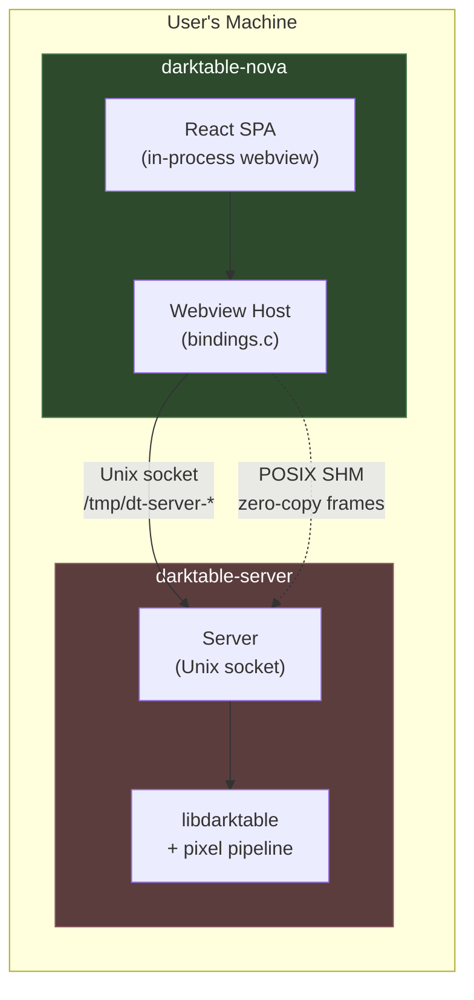

This is the current implementation. Everything runs on one machine. The webview host spawns the server as a child process, connects via Unix socket, and reads preview frames through shared memory. Latency is sub-millisecond for IPC, and frame delivery is zero-copy.

**Strengths**: Lowest latency, zero-copy frames, no network configuration, no authentication needed.
**Limitations**: Single machine only, single user.

### 6.2 Remote / LAN / Internet

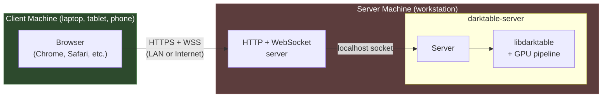

The architecture supports remote use by replacing the webview host layer with a thin HTTP/WebSocket gateway:

| Concern | Local (current) | Remote (proposed) |
| ------- | --------------- | ----------------- |
| UI delivery | `file://` in embedded webview | HTTPS static files (same React SPA) |
| RPC transport | Unix socket via `bindings.c` | WebSocket relay to server socket |
| Frame delivery | POSIX SHM → JPEG → base64 → JS bridge | JPEG via HTTP or WebSocket binary |
| Authentication | None (local process) | Token/session auth required |
| Latency | <1 ms IPC | 1–100 ms network |
| Frame rate | 10–15 fps (slider drag) | 5–10 fps (bandwidth-dependent) |
| Multi-client | No (single session) | Yes (needs session multiplexing) |

#### What Needs to Change

**Transport layer**: The React SPA's `api/commands.ts` currently calls `window.*` bindings injected by the webview host. For remote mode, these must be replaced with WebSocket RPC calls. The cleanest approach:

```typescript
// api/transport.ts — abstract transport
interface Transport {
  call(method: string, params: unknown): Promise<unknown>;
  onEvent(handler: (event: string, data: unknown) => void): void;
}

// Local: uses window.* bindings (current)
class WebviewTransport implements Transport { ... }

// Remote: uses WebSocket
class WebSocketTransport implements Transport { ... }
```

The rest of the UI code is transport-agnostic — stores call `transport.call()` instead of `window.*` directly.

**Frame delivery**: Over a network, POSIX SHM is not available. Frames must be delivered as:

- JPEG over HTTP (polling or long-poll) — simplest
- JPEG binary frames over WebSocket — lower latency
- WebRTC video stream — best for high-fps interactive editing, most complex

**Authentication**: The Unix socket is implicitly authenticated (only local processes can connect). Remote access requires:

- Session tokens or API keys
- TLS encryption (mandatory for Internet, recommended for LAN)
- Rate limiting and input validation at the gateway

**Session multiplexing**: The server already supports up to 4 sessions. A gateway could assign each remote client a separate session, enabling multi-user collaborative editing (or at minimum, independent editing of different images).

#### Gateway Architecture

```mermaid
graph TB
    subgraph gateway["WebSocket Gateway (new component)"]
        HTTP["HTTP Server<br/>static files + frame endpoint"]
        WSS["WebSocket Server<br/>RPC relay"]
        Auth["Auth Middleware<br/>token validation"]
        SM["Session Manager<br/>client → server session"]

        HTTP --> Auth
        WSS --> Auth
        Auth --> SM
    end

    subgraph clients["Remote Clients"]
        C1["Browser 1<br/>(editing image A)"]
        C2["Browser 2<br/>(editing image B)"]
        C3["Browser 3<br/>(lighttable only)"]
    end

    subgraph srv["darktable-server"]
        S1["Session 1<br/>(image A)"]
        S2["Session 2<br/>(image B)"]
        S3["(catalog queries)"]
    end

    C1 --> WSS
    C2 --> WSS
    C3 --> HTTP
    SM --> srv

    style gateway fill:#3d3d5c,stroke:#5c5c8a,color:#fff
    style clients fill:#2d4a2d,stroke:#4a7a4a,color:#fff
    style srv fill:#5c3d3d,stroke:#8a5c5c,color:#fff
```

The gateway is a separate process (~500–1000 lines) that:

1. Serves the React SPA as static files over HTTPS
2. Accepts WebSocket connections, authenticates, assigns server sessions
3. Relays JSON-RPC messages between WebSocket and Unix socket
4. Serves preview frames as JPEG over HTTP (or WebSocket binary)

**Key insight**: The React SPA itself needs minimal changes — only the transport layer. All UI components, stores, and controls work identically in both modes. This is the primary architectural advantage of the three-tier design.

#### Bandwidth Estimation

| Operation | Payload | Frequency | Bandwidth |
| --------- | ------- | --------- | --------- |
| RPC request/response | 0.5–2 KB JSON | 5–20/sec during editing | ~10–40 KB/s |
| Preview frame (1080p) | 150–300 KB JPEG | 5–10 fps during drag | 1–3 MB/s |
| Preview frame (4K) | 400–800 KB JPEG | 3–5 fps during drag | 1.5–4 MB/s |
| Thumbnail batch (50) | 200–500 KB | On scroll | Burst |
| Idle | Heartbeat only | 1/30 sec | ~1 KB/s |

A 10 Mbps connection handles 1080p interactive editing comfortably. 4K requires 30+ Mbps for smooth interaction. Adaptive quality (lower JPEG quality during drag, full quality on release) could halve bandwidth needs.

### 6.3 Native Mobile Apps (iPad / Android)

```mermaid
graph LR
    subgraph mobile["Mobile Device"]
        subgraph optA["Option A: Embedded WebView"]
            WKWebView["WKWebView / Android WebView"]
            SPA_M["React SPA<br/>(same codebase)"]
            WST["WebSocketTransport"]
            WKWebView --> SPA_M --> WST
        end
    end

    subgraph optB_device["Mobile Device (alt)"]
        subgraph optB["Option B: Native UI"]
            SwiftUI["SwiftUI / Jetpack Compose"]
            SDK["darktable-client SDK<br/>(Swift / Kotlin)"]
            SwiftUI --> SDK
        end
    end

    subgraph workstation["Workstation"]
        GW["WebSocket Gateway"]
        subgraph srv["darktable-server"]
            Server["Server + libdarktable"]
        end
        GW --> Server
    end

    WST -- "WSS" --> GW
    SDK -- "WSS" --> GW

    style mobile fill:#2d4a2d,stroke:#4a7a4a,color:#fff
    style optB_device fill:#3d4a3d,stroke:#4a7a4a,color:#fff
    style workstation fill:#5c3d3d,stroke:#8a5c5c,color:#fff
```

Mobile apps connect to a darktable server running on a workstation (or NAS/cloud VM) via the same WebSocket gateway used for browser-based remote access. Two implementation strategies:

#### Option A: Embedded WebView (low effort)

Wrap the existing React SPA in a native shell app (`WKWebView` on iOS, `WebView` on Android). The SPA uses `WebSocketTransport` instead of `WebviewTransport`. The native shell provides:

- App icon, launch screen, system integration
- Touch gesture handling (pinch-zoom, swipe between images)
- Push notifications (export complete, sync status)
- Local credential storage (Keychain / Android Keystore)

This reuses 100% of the UI code. The main work is touch-optimizing the CSS (larger hit targets, swipe gestures, responsive layout for smaller screens).

#### Option B: Native UI (high effort, better UX)

Build a platform-native UI (SwiftUI / Jetpack Compose) with a thin client SDK that speaks the same JSON-RPC protocol over WebSocket. Benefits:

- Native gestures, animations, and platform conventions
- Better performance on low-end devices (no JS overhead)
- Offline support with local thumbnail cache
- Platform-specific features (Apple Pencil pressure, Android split-screen)

The client SDK would be a small library (~1000 lines) wrapping the WebSocket connection, JSON-RPC framing, and session management. The same SDK could be published for third-party integrations.

#### Mobile-Specific Considerations

| Concern | Impact | Mitigation |
| ------- | ------ | ---------- |
| Intermittent connectivity | Lost frames, stale UI | Reconnect logic, optimistic local state |
| High latency (cellular) | Sluggish slider interaction | Debounce more aggressively, show local preview |
| Small screen | 89 modules don't fit | Collapsible groups, search, favorites-only mode |
| Touch input | No right-click, hover, or fine pointer | Redesign context menus, enlarge controls |
| Battery / thermal | Continuous WebSocket + JPEG decode | Reduce frame rate when on battery, pause when backgrounded |
| Data usage (cellular) | 1–3 MB/s during editing | Adaptive JPEG quality, thumbnail resolution tiers |

**Recommendation**: Start with Option A (embedded WebView). It validates the remote protocol with minimal effort. If mobile becomes a priority, invest in Option B for the darkroom view (where touch UX matters most) while keeping the lighttable as a WebView.

---

## 7. Architectural Options

### 7.1 Frame Delivery (High Priority)

```mermaid
graph TD
    subgraph current["Current Path"]
        A1["SHM (BGRA8)"] --> A2["JPEG compress"] --> A3["base64 encode"] --> A4["data URI string"] --> A5["JS bridge"] --> A6["img.src"]
    end

    subgraph optionB["Option B: HTTP Frame Server ✅"]
        B1["SHM (BGRA8)"] --> B2["JPEG compress"] --> B3["HTTP response<br/>binary JPEG"] --> B4["img.src =<br/>localhost:PORT/frame"]
    end

    subgraph optionA["Option A: WebSocket"]
        WS1["SHM (BGRA8)"] --> WS2["JPEG compress"] --> WS3["WebSocket<br/>binary frame"] --> WS4["Blob URL"]
    end

    subgraph optionC["Option C: SharedArrayBuffer"]
        C1["SHM mmap"] --> C2["SharedArrayBuffer"] --> C3["OffscreenCanvas"]
    end

    style optionB fill:#2d4a2d,stroke:#4a7a4a,color:#fff
```

**Recommendation**: Option B — local HTTP frame server. Simplest path to eliminating base64 overhead (33% size savings). The `dt_frame_server_t` infrastructure already exists.

### 7.2 Windows IPC (Medium Priority)

| Option | Transport | Pros | Cons |
| ------ | --------- | ---- | ---- |
| **A: Named pipes** | `\\.\pipe\dt-server` | Windows-native, low latency, secure | Platform #ifdefs |
| **B: TCP loopback** | `127.0.0.1:PORT` | Cross-platform, no #ifdefs | Firewall, port allocation |
| **C: stdio pipes** | stdin/stdout | Simplest, cross-platform | No SHM equivalent |

**Recommendation**: Option A for IPC (named pipes), with TCP as fallback. Windows will need a different frame delivery approach regardless (no POSIX SHM).

### 7.3 Eliminate Mirror Structs (High Priority)

```mermaid
graph LR
    subgraph current["Current: Mirror Structs"]
        Cast["(_server_colorin_params_t *)<br/>target->params"]
        Field["p->type, p->filename"]
        Risk["⚠️ Silent corruption<br/>if layout drifts"]
        Cast --> Field --> Risk
    end

    subgraph optionA["Option A: Introspection Lookup ✅"]
        Lookup["dt_introspection_get_field(intro, 'type')"]
        Offset["field->header.offset"]
        Read["*(int*)(params + offset)"]
        Lookup --> Offset --> Read
    end

    style optionA fill:#2d4a2d,stroke:#4a7a4a,color:#fff
    style Risk fill:#5c2d2d,stroke:#8a4a4a,color:#fff
```

**Recommendation**: Option A for colorin/colorout (simple field reads). Keep mirrors for temperature (spectral math needing multiple fields) and exposure (pipe data struct), but add `static_assert` size checks.

### 7.4 Request Pipeline (Medium Priority)

```mermaid
graph TD
    subgraph current["Current: Sync Dispatch"]
        R1["Request 1"] --> H1["Handler (100ms)"]
        H1 --> R2["Request 2"]
        R2 --> H2["Handler (50ms)"]
        H2 --> R3["Request 3"]
    end

    subgraph proposed["Proposed: Async + Cancel"]
        RA["Request A"] --> HA["Handler (async)"]
        RB["Request B"] --> HB["Handler (fast)"]
        RC["Cancel A"] --> CA["Abort pipeline"]

        HA -. "event: done" .-> Result
        HB --> ResultB["Response"]
    end

    style proposed fill:#2d4a2d,stroke:#4a7a4a,color:#fff
```

**Recommendation**: Extend the existing async pipeline pattern. Add `develop.cancel_pipeline` method. Keep sync dispatch for fast operations (<10ms).

### 7.5 Module System Simplification (Low Priority)

Replace 89 individual `.tsx` files with a configuration-driven approach:

```typescript
// registry.ts — no separate files needed for generic modules
{ op: "bloom", name: "bloom", group: EFFECTS },
{ op: "borders", name: "framing", group: EFFECTS },
// ...

// Only custom modules need separate files:
{ op: "channelmixerrgb", name: "color calibration",
  component: lazy(() => import("./ChannelMixerRgbModule")) },
{ op: "temperature", name: "white balance",
  component: lazy(() => import("./TemperatureModule")) },
```

Modules without an explicit `component` field automatically use `GenericIopModule`. This would reduce ~70 trivial wrapper files.

---

## 8. Metrics

| Metric | Value |
|--------|-------|
| C code (server + webview) | ~7,500 lines |
| TypeScript/React (UI) | ~13,700 lines |
| CSS | ~800 lines |
| Total IOP modules | 89 (10 custom, 79 generic) |
| API surface (JS bindings) | ~50 functions |
| Server API routes | 35 |
| Zustand stores | 9 |
| Bauhaus controls | 14 |
| Max concurrent sessions | 4 |
| Max concurrent IPC requests | 32 |
| Max message size | 16 MB |
| Event poll interval | 50 ms |
| Preview SHM format | BGRA8, double-buffered |
| JPEG quality | 92 |
| SHM header size | 64 bytes |

---

## 9. Dependency Map

```mermaid
graph TB
    subgraph nova["darktable-nova"]
        WV["webview_core_static<br/>(C++ WebKit/WebView2)"]
        NFD["nfd<br/>(native file dialog)"]
        GLIB["glib-2.0 + json-glib"]
        JPEG["libjpeg"]
        PTH["pthread"]
    end

    subgraph server["darktable-server"]
        LDT["libdarktable<br/>(full image processing)"]
        SQL["SQLite"]
        OCL["OpenCL<br/>(optional GPU)"]
        SHM["POSIX SHM"]
    end

    subgraph platform["Platform Backend"]
        MAC["macOS: WebKit + Cocoa"]
        LIN["Linux: GTK3 + WebKitGTK"]
        WIN["Windows: WebView2 + DWM"]
    end

    subgraph ui_deps["UI (React SPA)"]
        REACT["react 18 + react-dom"]
        ZUS["zustand 5"]
        LUCIDE["lucide-react"]
        TW["tailwindcss 4"]
        TS["typescript 5.6"]
        VITE["vite 6"]
    end

    nova --> WV
    nova --> NFD
    nova --> GLIB
    nova --> JPEG
    nova --> PTH
    nova --> server
    WV --> platform
    server --> LDT
    LDT --> SQL
    LDT --> OCL
    server --> SHM

    style nova fill:#3d3d5c,stroke:#5c5c8a,color:#fff
    style server fill:#5c3d3d,stroke:#8a5c5c,color:#fff
    style platform fill:#3d3d3d,stroke:#666,color:#fff
    style ui_deps fill:#2d4a2d,stroke:#4a7a4a,color:#fff
```

---

## 10. File Map

```
src/server/
├── main.c                    # Standalone server entry point
├── server.h                  # Core types, routes, handler decls
├── server.c                  # Socket, accept, dispatch, events
├── server_protocol.h         # Wire format, SHM, error codes
├── server_protocol.c         # Frame I/O, JSON builders
├── server_develop.c          # Develop: params, history, pipeline, introspection
├── server_catalog.c          # Catalog: query, thumbnails, import
├── server_events.c           # Signal→event bridge
└── server_export.c           # Image export

src/webview/
├── main.c                    # Process entry, server spawn, webview init
├── bindings.h                # Context struct, SHM tracking
├── bindings.c                # 50 JS↔C bindings, frame server
├── ipc.h                     # IPC context type
├── ipc.c                     # Socket, reader thread, pending slots
├── splash.c                  # Splash screen
├── titlebar.h                # Platform titlebar API
├── platform/
│   ├── titlebar_macos.m      # Cocoa: transparent titlebar
│   ├── titlebar_linux.c      # GTK3: CSD + edge resize
│   └── titlebar_windows.c    # DWM: frame extension
└── docs/
    └── ARCHITECTURE.md        # This document

ui/src/
├── main.tsx                  # React root
├── App.tsx                   # Layout, view routing
├── api/
│   ├── commands.ts           # Typed window.* wrappers (189 lines)
│   ├── events.ts             # __dt_event pub/sub (29 lines)
│   └── thumbnailBatch.ts     # Batch thumbnail loader
├── stores/
│   ├── developStore.ts       # Session, params, history, preview (652 lines)
│   ├── catalogStore.ts       # Image list, selection (163 lines)
│   ├── importStore.ts        # File browser, batch import (349 lines)
│   ├── filterStore.ts        # Collection rules, sort (239 lines)
│   ├── collectionsStore.ts   # Saved collections (243 lines)
│   ├── uiStore.ts            # View state, layout (107 lines)
│   ├── overlayStore.ts       # Thumbnail overlays (90 lines)
│   ├── pickerStore.ts        # Color picker (58 lines)
│   └── connectionStore.ts    # Server connection (34 lines)
├── components/
│   ├── controls/             # 14 Bauhaus widgets
│   ├── modules/
│   │   ├── registry.ts       # Op→component mapping
│   │   ├── IopModuleCard.tsx  # Module chrome wrapper
│   │   ├── iop/              # 89 IOP module components
│   │   └── lib/              # Library modules
│   ├── Darkroom/             # Darkroom view + preview
│   ├── Lighttable/           # Lighttable view + toolbar
│   ├── ThumbTable/           # Thumbnail grid
│   ├── Sidebar/              # Sidebar modules
│   ├── Import/               # Import dialog
│   └── Layout/               # Header, sidebar, bottom bar
├── types/                    # Protocol + collection types
├── events/                   # Local event bus
├── hooks/                    # Custom React hooks
└── themes/                   # CSS variables, darktable theme
```
