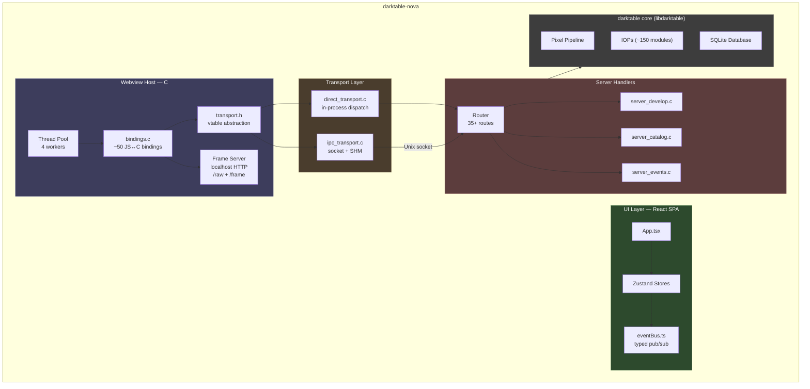
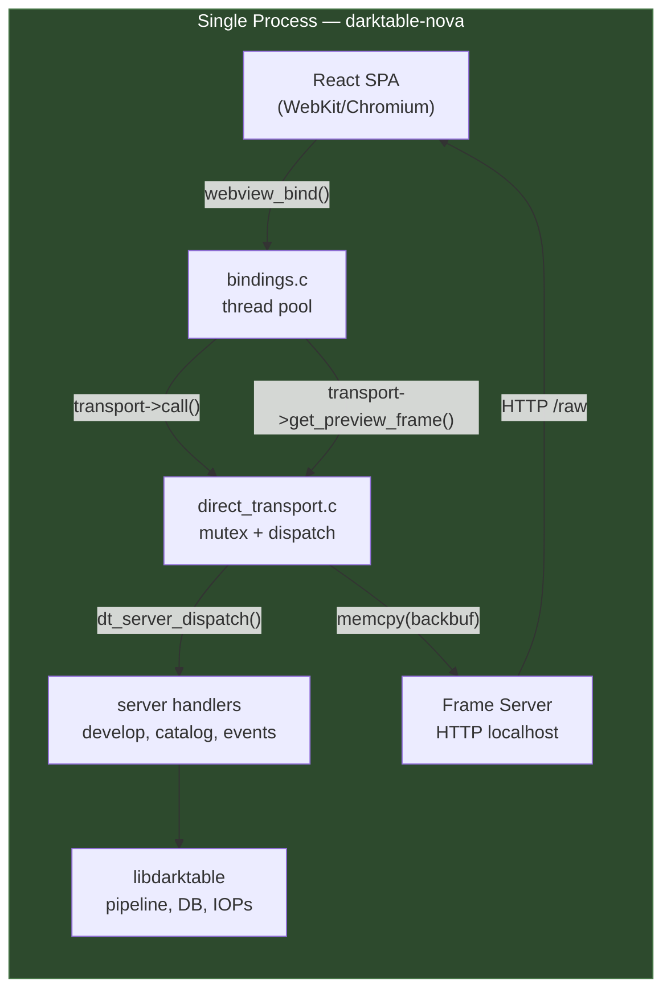
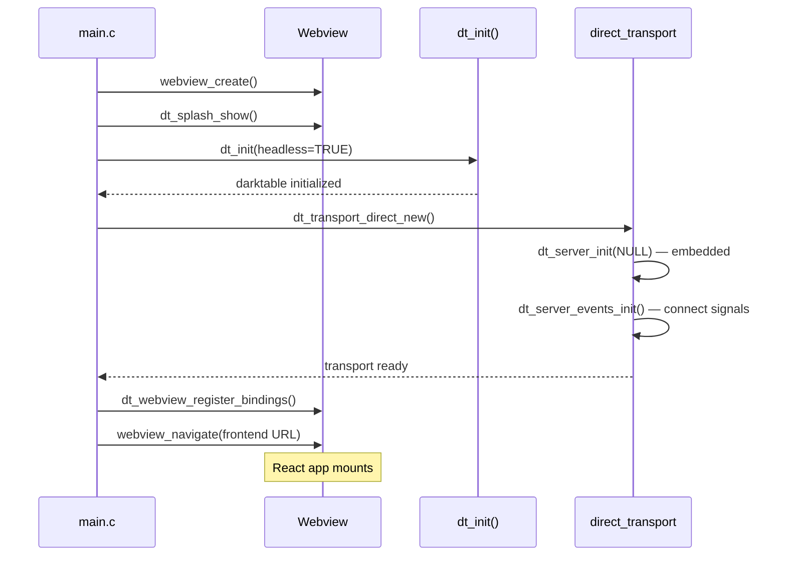
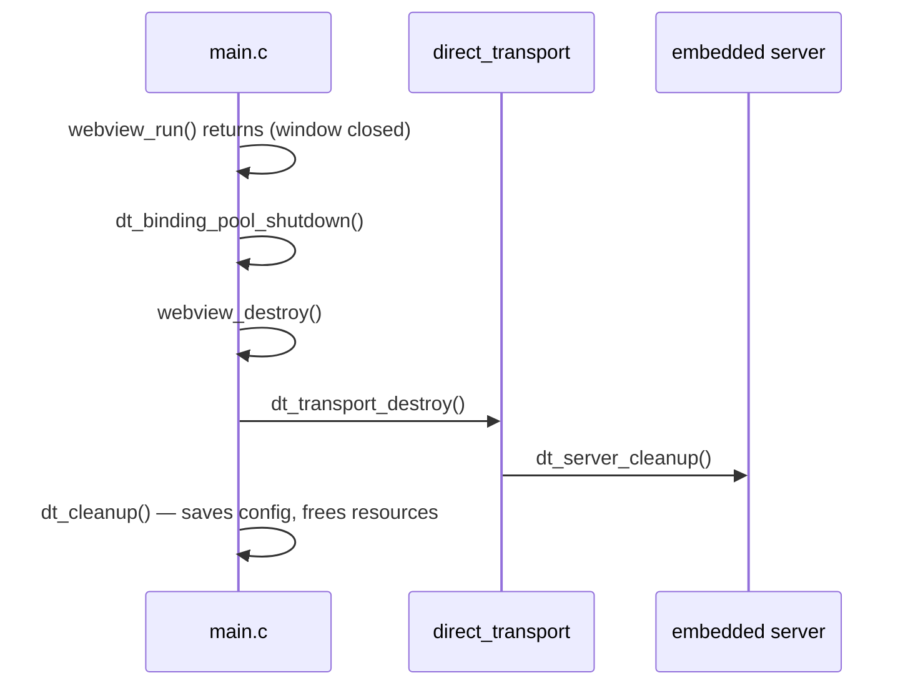
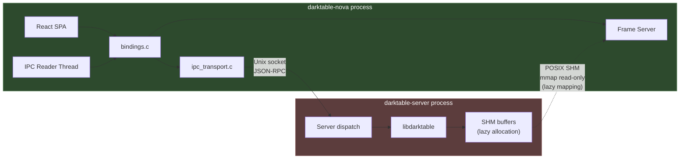
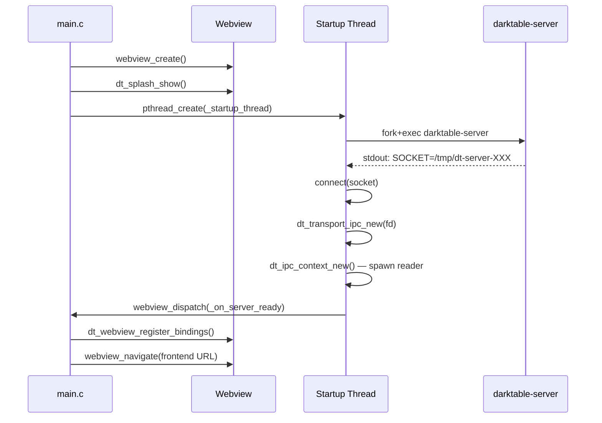
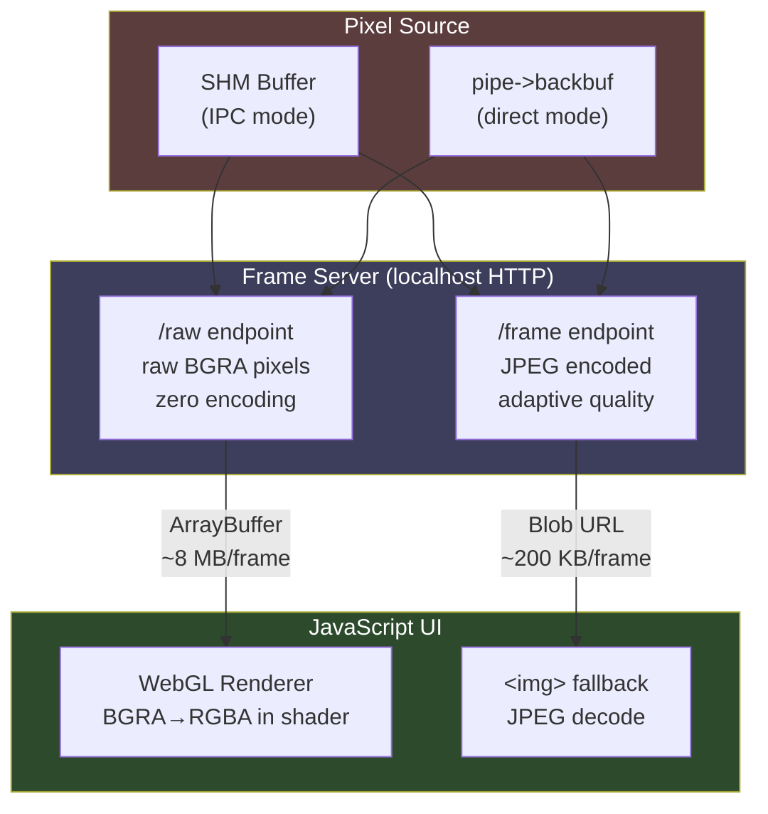
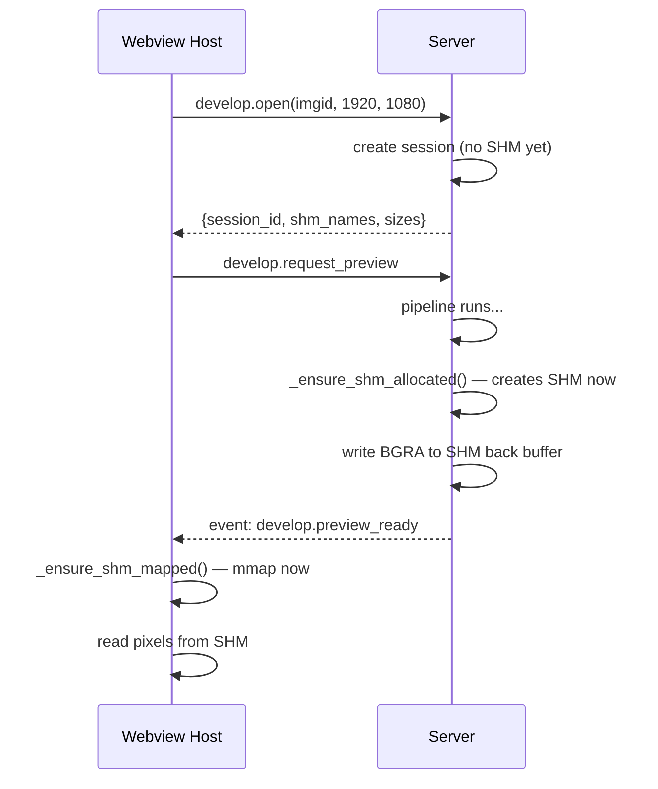
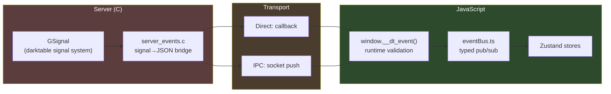

# NOVA Architecture — Transport Layer Update

> Supplement to ARCHITECTURE.md reflecting the hybrid direct/IPC transport
> architecture implemented in Phase 2-3.

**Date**: March 2026

---

## 1. Updated System Overview

The original architecture described a single-mode system (webview host +
server process via Unix socket). NOVA now supports **two transport modes**
selectable at startup:



---

## 2. Transport Abstraction

The transport vtable (`src/webview/transport.h`) decouples the binding layer
from the communication mechanism. All bindings call through this interface —
they don't know or care whether they're talking to an in-process server or a
remote one.

### 2.1 Vtable Interface

```c
struct dt_webview_transport_t
{
    void *data;  // opaque implementation state

    // Generic JSON-RPC call — covers all 35+ server methods
    char *(*call)(self, method, params_json, &error);

    // Direct pixel access — avoids JSON for preview frames
    gboolean (*get_preview_frame)(self, session_id, &out_frame);

    // Server-pushed event subscription
    void (*set_event_callback)(self, callback, user_data);

    // Cleanup
    void (*destroy)(self);
};
```

### 2.2 Frame Data Type

```c
typedef struct dt_transport_frame_t {
    const uint8_t *pixels;   // BGRA8 pixel data
    int width, height;
    uint64_t sequence;       // frame sequence number
    gboolean owned;          // TRUE → caller must g_free(pixels)
} dt_transport_frame_t;
```

- **IPC transport**: returns an owned copy (memcpy from SHM)
- **Direct transport**: returns an owned copy (memcpy from backbuf under mutex)

### 2.3 Convenience Macros

```c
dt_transport_call(t, method, params, err)
dt_transport_get_preview_frame(t, sid, frame)
dt_transport_set_event_callback(t, cb, ud)
dt_transport_destroy(t)
```

---

## 3. Direct Mode (Default)

```
darktable-nova              # direct mode (default)
darktable-nova --core --configdir ~/.config/darktable-test
```



### Architecture

- `dt_transport_direct_new()` creates an embedded `dt_server_t` (no socket)
- `_direct_call()` builds a JSON-RPC request, passes it to `dt_server_dispatch()`
- A coarse mutex serializes all dispatch calls (handlers have their own
  per-session locking, but the sessions array is unprotected shared state)
- Events flow via callback: signal handler → `dt_server_queue_event()` →
  `_server_event_bridge()` → webview's `__dt_event`

### Startup Flow



### Shutdown Flow



### Key Properties

| Property | Value |
|----------|-------|
| Latency | ~0.1 ms per RPC call |
| Frame delivery | HTTP /raw (raw BGRA, ~8 MB for 1080p) |
| Concurrency | 4 binding workers, serialized by transport mutex |
| Memory | Single process, no SHM overhead |
| Platform | All (macOS, Linux, Windows) |

---

## 4. IPC (Server) Mode

```
darktable-nova --server
darktable-nova --server-bin /path/to/darktable-server
```



### Startup Flow



### Key Properties

| Property | Value |
|----------|-------|
| Latency | ~1-2 ms per RPC call (socket round-trip) |
| Frame delivery | SHM → HTTP /raw or /frame |
| SHM allocation | Lazy — deferred to first pipeline render |
| SHM mapping | Lazy — deferred to first frame read |
| Concurrency | Async socket I/O, no shared mutex |
| Process isolation | Server crash doesn't kill webview |

---

## 5. Frame Delivery Pipeline

Both transport modes use the same HTTP frame server for delivering pixels to
the JS UI. The webview binding layer cannot return binary data (strings only),
so HTTP is the bridge.



### Endpoints

| Endpoint | Format | Size (1080p) | Use case |
|----------|--------|-------------|----------|
| `/raw?s=SID&b=BUF&seq=N` | Raw BGRA | ~8 MB | Primary — WebGL rendering |
| `/frame?s=SID&b=BUF&q=Q` | JPEG | ~200 KB | Fallback / remote mode |

### Adaptive JPEG Quality

The `/frame` endpoint accepts an optional `q=` parameter (10–100):

| Context | Quality | Size (1080p) | Flag |
|---------|---------|-------------|------|
| Interactive (slider drag) | 60 | ~100 KB | `ADAPTIVE_JPEG=1` |
| Final (slider release) | 92 | ~200 KB | Default |

Controlled by `ADAPTIVE_JPEG` define in `bindings.c` and `ADAPTIVE_JPEG`
const in `developStore.ts`. Set to 0/false to always use full quality.

### SHM Lazy Allocation (IPC Mode)

SHM buffers are allocated on-demand to avoid wasting memory for sessions
that never render:



---

## 6. Event System

Server-pushed events flow through a unified typed event bus.

### Server → JS Event Flow



### Event Types (EventMap)

| Event | Payload | Source |
|-------|---------|--------|
| `collection.changed` | `{change_type?, reason?}` | Server signal |
| `image.imported` | `{imgid}` | Server signal |
| `image.thumbnail_ready` | `{imgid}` | Server signal |
| `develop.preview_ready` | `{session_id, front_buffer, width, height, sequence}` | Server signal |
| `develop.history_changed` | `{}` | Server signal |
| `import.finished` | `{imported, skipped}` | Client-only |
| `view.changed` | `{view}` | Client-only |

### Runtime Validation

The `__dt_event` bridge validates incoming server events against
`KNOWN_SERVER_EVENTS`. Unknown events trigger a console warning.
Sequence gap detection catches dropped events via `checkSequenceGap()`.

---

## 7. Updated File Map

### Transport Layer (new in Phase 2-3)

| File | Purpose |
|------|---------|
| `src/webview/transport.h` | Transport vtable interface, frame type, factory declarations |
| `src/webview/direct_transport.c` | In-process transport — dispatch through server route table |
| `src/webview/ipc_transport.c` | Socket-based transport — JSON-RPC over Unix socket |

### Updated Files

| File | Changes |
|------|---------|
| `src/webview/main.c` | Transport mode selection (`--server` flag), direct mode startup with `dt_init()`, RAM check |
| `src/webview/bindings.c` | Thread pool (4 workers), lazy SHM mapping, frame server with `/raw` + `/frame` endpoints, adaptive JPEG quality |
| `src/server/server_develop.c` | Lazy SHM allocation (`_ensure_shm_allocated`), preview cap at 1920x1080 |
| `src/server/server_events.c` | Signal→event bridge (5 signals connected) |
| `ui/src/events/eventBus.ts` | Typed event bus with `EventMap`, server event validation, sequence gap detection |
| `ui/src/stores/developStore.ts` | Event-driven preview updates, `interacting` flag, adaptive JPEG quality |

---

## 8. Corrections to ARCHITECTURE.md

The following items in the original ARCHITECTURE.md are now outdated:

### Section 1 — System Overview
The diagram shows only IPC mode. Both direct and IPC modes are now supported.
The "single process" label is accurate for direct mode; IPC mode uses two
processes.

### Section 2 — Process Lifecycle
Only describes IPC startup (fork+exec server). Direct mode skips this entirely
and calls `dt_init()` in-process.

### Section 3.2 — Webview Host Layer
- Missing: `transport.h`, `direct_transport.c`, `ipc_transport.c`
- `bindings.c` now uses a thread pool (4 workers) instead of spawning a
  pthread per call
- SHM mapping is now lazy (`_ensure_shm_mapped`)

### Section 3.3 — UI Layer
- `api/events.ts` has been replaced by `events/eventBus.ts` (typed event bus)
- Store line counts are higher (developStore ~650 lines)

### Section 4.1 — Slider Drag Data Flow
- Frame delivery now uses HTTP `/raw` endpoint (raw BGRA → WebGL), not
  JPEG+base64 through the JS bridge
- Event name is `develop.preview_ready`, not `pipeline.finished`

### Section 4.4 — Double-Buffered Preview
- JPEG compression is no longer the primary path; raw BGRA is served directly
- SHM allocation is lazy (deferred to first render)
- Client-side SHM mapping is lazy (deferred to first frame read)

### Section 5.2 — Weaknesses
- "JPEG compression bottleneck" — **partially resolved**. The `/raw` endpoint
  serves uncompressed BGRA for WebGL rendering. JPEG is only used as a fallback.
- "Event handling is fragile" — **resolved**. The typed event bus validates
  server events, detects sequence gaps, and provides compile-time type safety.
- "Single-threaded request handling" — **partially resolved** in direct mode.
  The binding thread pool allows 4 concurrent requests, though the transport
  mutex serializes them at the dispatch level.

### Section 6.1 — Local Desktop
Now describes only IPC mode. Direct mode is the new default for local desktop
use (lower latency, no IPC overhead, simpler deployment).
