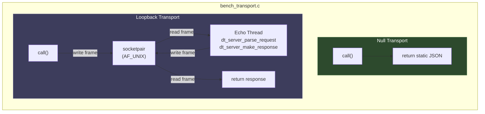
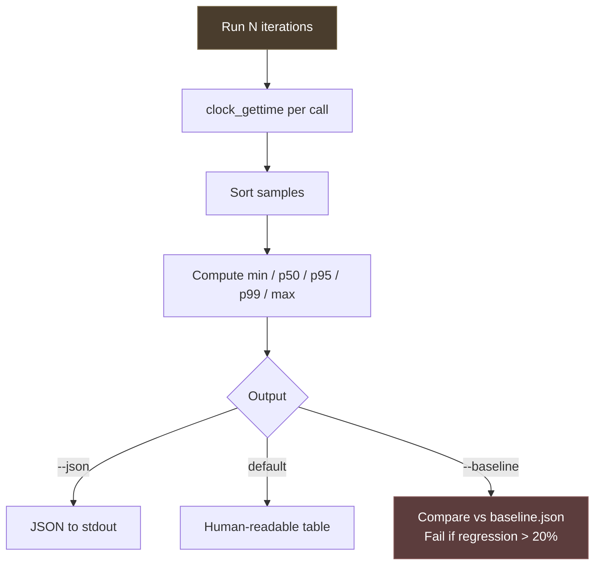

# NOVA Performance Testing

> Benchmark harness for measuring transport layer latency and memory overhead.

---

## 1. Architecture

The NOVA UI communicates with libdarktable through a **transport vtable** (`dt_webview_transport_t` in `src/webview/transport.h`). Two implementations are planned:

- **Direct transport** — in-process function calls, zero serialization
- **IPC transport** — Unix domain socket with JSON-RPC framing + shared memory for preview frames

The benchmark harness measures the cost of the transport layer in isolation, without requiring a running darktable instance or test images. It does this by providing two self-contained transport implementations:





### Why two transports?

| Transport | What it measures | Purpose |
|-----------|-----------------|---------|
| **Null** | Vtable dispatch + `g_strdup` + timing overhead | The floor — if this regresses, the issue is the build or system, not the transport |
| **Loopback** | Full Unix socket round-trip: serialize → write frame → kernel context switch → read frame → parse → build response → write frame → kernel → read frame | Real IPC cost without server logic. Predicts overhead of the future IPC transport |

The **ratio** between them estimates how many times slower IPC will be compared to direct function calls — the key metric for validating the hybrid architecture.

### Extensibility

When `dt_transport_ipc_new()` and `dt_transport_direct_new()` are implemented, they can be added as additional benchmark cases with no structural changes — just instantiate them and pass to `_run_benchmark()`.

---

## 2. Files

| File | Description |
|------|-------------|
| `src/tests/perf/bench_transport.c` | Latency benchmark — null and loopback transports |
| `src/tests/perf/bench_memory.sh` | RSS measurement — direct vs IPC mode |
| `src/tests/perf/baseline.json` | Reference values for regression detection |
| `src/tests/perf/CMakeLists.txt` | Build config, CTest label `perf` |
| `src/tests/perf/PERFORMANCE.md` | This document |

---

## 3. How to run

### Build

```bash
cmake -B build -DBUILD_TESTING=ON
cmake --build build --target bench_transport
```

### Latency benchmark

```bash
# Default: 10,000 iterations, human-readable table
./build/bin/tests/perf/bench_transport

# More iterations for stable percentiles
./build/bin/tests/perf/bench_transport --iterations 50000

# JSON output (for scripting or storing new baselines)
./build/bin/tests/perf/bench_transport --json

# Regression check against baseline
./build/bin/tests/perf/bench_transport --baseline src/tests/perf/baseline.json

# Custom threshold (default: 20%)
./build/bin/tests/perf/bench_transport --baseline src/tests/perf/baseline.json --threshold 10
```

### Memory benchmark

```bash
# Human-readable output
src/tests/perf/bench_memory.sh

# JSON output
src/tests/perf/bench_memory.sh --json

# With regression check
src/tests/perf/bench_memory.sh --baseline src/tests/perf/baseline.json

# Custom build directory
src/tests/perf/bench_memory.sh --build-dir ./build-release
```

### Via CTest

```bash
cd build && ctest -L perf --output-on-failure
```

---

## 4. Reading the output

```
Transport                   min(us)    p50(us)    p95(us)    p99(us)    max(us)   throughput
------------------------ ---------- ---------- ---------- ---------- ---------- ------------
null                          0.000      0.000      0.000      1.000      1.000   52301255 rps
loopback                      8.000     13.000     15.000     25.000    473.000      76849 rps

Socket overhead: 650x (loopback mean / null mean)
```

### Columns

| Column | Meaning | Use |
|--------|---------|-----|
| **min** | Fastest single call | Theoretical best case |
| **p50** | Median — half the calls are faster | "Typical" latency users experience |
| **p95** | 95th percentile — 1 in 20 calls is slower | Shows consistency |
| **p99** | 99th percentile — 1 in 100 calls is slower | **Used for regression detection** — catches tail latency without noise from rare outliers |
| **max** | Worst single call | Often noisy (OS scheduling, GC). Not used for regression detection |
| **throughput** | Requests per second (1M / mean_us) | Transport capacity |

### Regression check output

```
[OK] loopback p99: 25.0 us (baseline 50.0 us, -50%)      ← passes
[REGRESSION] loopback p99: 85.0 us → baseline 50.0 us (+70%, threshold 20%)  ← fails
```

Exit code 0 = all checks pass. Exit code 1 = at least one regression detected.

---

## 5. First results

### Test conditions

| Parameter | Value |
|-----------|-------|
| Hardware | Apple M4 |
| OS | macOS 26.3 (Darwin 25.3.0) |
| Build | cmake -DCMAKE_BUILD_TYPE=RelWithDebInfo, -O3 -ffast-math |
| Iterations | 50,000 |
| Date | 2026-03-08 |

### Latency

| Transport | min | p50 | p95 | p99 | max | throughput |
|-----------|-----|-----|-----|-----|-----|------------|
| null | <0.001 us | <0.001 us | <0.001 us | 1.0 us | 1.0 us | ~52M rps |
| loopback | 8.0 us | 13.0 us | 15.0 us | 25.0 us | 473.0 us | ~77K rps |

**Socket overhead: ~650x**

### Interpretation

- The null transport is effectively free (<20 ns mean). This confirms that the vtable abstraction adds negligible overhead — the transport implementation dominates.
- The loopback transport shows a p50 of 13 µs for a full Unix socket round-trip with JSON-RPC framing. This is the inherent cost of IPC.
- The p95 (15 µs) is close to p50, indicating stable performance. The p99 (25 µs) shows occasional kernel scheduling delays.
- The max (473 µs) is a rare outlier — likely a context switch or cache miss. Not actionable.
- At 77K round-trips/sec, the transport can handle far more than the ~60 parameter updates/sec a user generates during slider dragging.

### What these numbers predict

When the real transports are implemented:

- **Direct transport** should approach null performance for simple parameter writes (struct field assignment + signal emission, ~1-5 µs).
- **IPC transport** should be close to loopback (~13 µs) plus server-side parameter handling (~10-50 µs), totaling ~25-65 µs per set_param call.
- The **overhead ratio** (direct vs IPC) should be 10-50x, well within the architectural target of keeping IPC viable for remote/multi-user scenarios while direct mode gives near-native performance.
