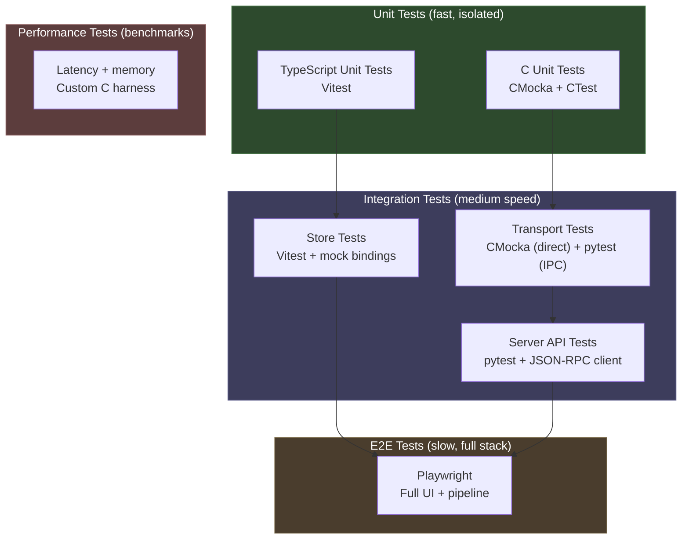
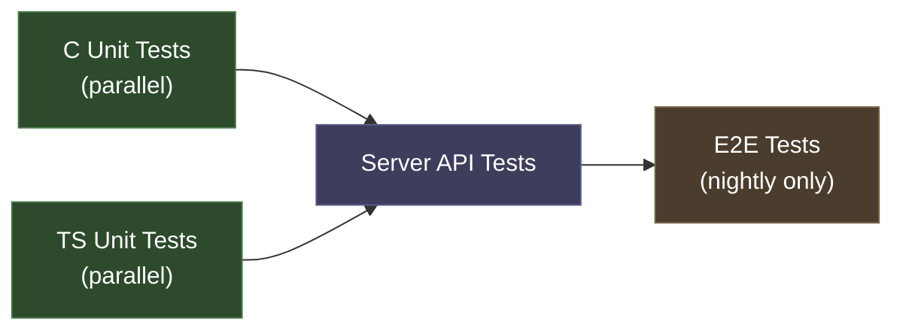

# NOVA Testing Strategy

> Automated testing plan for the NOVA architecture (Alternative E: hybrid direct/IPC).

**Date**: March 2026
**Scope**: Unit, integration, E2E, and performance testing across C and TypeScript layers

---

## 1. Current State

| Layer | Framework | Coverage | Status |
| ----- | --------- | -------- | ------ |
| darktable core (C) | CMocka + CTest | 2 test suites (sample, filmicrgb) | Minimal |
| Integration (visual) | Shell + delta-E | 185+ test cases | Manual, not in CI |
| Server API (C) | Python test_client.py | ~15 RPC methods | Manual, no assertions |
| React UI (TypeScript) | None | 0% | Not configured |
| E2E (full stack) | None | 0% | Not configured |
| CI pipeline | GitHub Actions | Build only | `skiptest` target |

**Key gaps**:

- Server protocol and RPC handlers have zero automated tests
- Transport abstraction (Alternative E) has no test harness
- React stores and components are untested
- CI doesn't run any tests (`skiptest` target)
- Python test_client.py is a manual smoke test with no assertions framework

---

## 2. Testing Architecture



**Execution targets**:

| Level | Runtime | When to run | CI gate? |
| ----- | ------- | ----------- | -------- |
| Unit (C) | < 5 sec | Every build | Yes |
| Unit (TS) | < 10 sec | Every build | Yes |
| Integration (transport) | < 30 sec | Every build | Yes |
| Integration (API) | < 60 sec | Every PR | Yes |
| Integration (stores) | < 15 sec | Every PR | Yes |
| E2E | < 5 min | Nightly + pre-release | No (flaky risk) |
| Performance | < 2 min | Weekly + manual | No (variance) |

---

## 3. Layer 1: C Unit Tests (CMocka)

### 3.1 Transport Vtable Tests

Test the transport abstraction layer in isolation. Each transport implementation gets its own test suite.

**File**: `src/tests/unittests/nova/test_transport.c`

```c
/* Test: direct transport set_param writes to module->params */
static void test_direct_set_param(void **state)
{
    dt_nova_transport_t *t = dt_nova_transport_direct_new();
    /* Setup: create a mock module with known params */
    dt_iop_module_t *module = _create_test_module("exposure");

    float value = 1.5f;
    int rc = t->set_param(t, module->dev->image_storage.id,
                          "exposure", 0, "exposure", &value, sizeof(float));
    assert_int_equal(rc, 0);

    /* Verify: param written directly to module->params */
    dt_iop_exposure_params_t *p = (dt_iop_exposure_params_t *)module->params;
    assert_float_equal(p->exposure, 1.5f, 1e-6f);

    t->destroy(t);
}

/* Test: IPC transport serializes correctly */
static void test_ipc_set_param_serialization(void **state)
{
    /* Capture what IPC transport sends over the socket */
    int fds[2];
    socketpair(AF_UNIX, SOCK_STREAM, 0, fds);

    dt_nova_transport_t *t = dt_nova_transport_ipc_new_fd(fds[0]);

    float value = 2.0f;
    t->set_param(t, 1, "exposure", 0, "exposure", &value, sizeof(float));

    /* Read and verify JSON-RPC message from other end */
    char buf[4096];
    uint32_t len;
    read(fds[1], &len, 4);
    len = ntohl(len);
    read(fds[1], buf, len);
    buf[len] = '\0';

    JsonParser *parser = json_parser_new();
    json_parser_load_from_data(parser, buf, len, NULL);
    JsonObject *root = json_node_get_object(json_parser_get_root(parser));

    assert_string_equal(json_object_get_string_member(root, "method"),
                        "develop.set_params");

    g_object_unref(parser);
    t->destroy(t);
    close(fds[0]); close(fds[1]);
}
```

**Test cases**:

- `test_direct_set_param` -- writes float, int, enum, array, string param types
- `test_direct_get_params` -- reads back params as JSON
- `test_direct_process_image` -- returns backbuffer pointer
- `test_ipc_set_param_serialization` -- verifies JSON-RPC format
- `test_ipc_roundtrip` -- socketpair, send request, verify response
- `test_transport_selection` -- `dt_nova_transport_direct_new()` vs `_ipc_new()`
- `test_transport_null_safety` -- NULL module, invalid param name, etc.

**CMakeLists.txt addition**:

```cmake
# src/tests/unittests/nova/CMakeLists.txt
add_cmocka_mock_test(test_transport
    SOURCES test_transport.c
    LINK_LIBRARIES lib_darktable darktable_nova cmocka
    MOCKS dt_iop_color_picker_reset)

add_cmocka_test(test_protocol
    SOURCES test_protocol.c
    LINK_LIBRARIES lib_darktable cmocka)
```

### 3.2 Protocol Tests

Test JSON-RPC message framing, parsing, and error handling.

**File**: `src/tests/unittests/nova/test_protocol.c`

**Test cases**:

- `test_frame_encode_decode` -- 4-byte length prefix round-trip
- `test_json_rpc_valid_request` -- well-formed request parsing
- `test_json_rpc_missing_method` -- returns error -32600
- `test_json_rpc_unknown_method` -- returns error -32601
- `test_json_rpc_invalid_params` -- returns error -32602
- `test_frame_max_size` -- reject messages > 10 MB
- `test_frame_zero_length` -- reject empty frames
- `test_concurrent_requests` -- multiple in-flight request IDs

### 3.3 Pipeline Worker Tests

Test async pipeline worker thread behavior.

**File**: `src/tests/unittests/nova/test_pipeline_worker.c`

**Test cases**:

- `test_worker_starts_and_stops` -- lifecycle
- `test_worker_processes_job` -- queue job, wait for completion event
- `test_worker_cancellation` -- cancel in-flight render via atomic flag
- `test_worker_coalescing` -- rapid queue, only latest processed
- `test_worker_server_responsive_during_render` -- main loop handles ping while pipeline runs

### 3.4 Security Tests

**File**: `src/tests/unittests/nova/test_security.c`

**Test cases**:

- `test_path_allowed_home` -- home directory allowed
- `test_path_blocked_etc` -- `/etc/passwd` blocked
- `test_path_traversal_dotdot` -- `../../etc/passwd` blocked
- `test_path_symlink_escape` -- symlink pointing outside allowed roots blocked
- `test_path_null_byte` -- embedded `\0` rejected
- `test_config_key_allowed` -- whitelisted keys pass
- `test_config_key_blocked` -- `opencl_device` rejected
- `test_socket_permissions` -- verify `fchmod(0600)` applied

---

## 4. Layer 2: TypeScript Unit Tests (Vitest)

### 4.1 Setup

Vitest is the natural choice for a Vite-based project -- zero config, same transform pipeline.

**Install**:

```bash
cd ui
npm install -D vitest @testing-library/react @testing-library/jest-dom jsdom
```

**`ui/vite.config.ts`** (add test config):

```typescript
import { defineConfig } from "vite";
import react from "@vitejs/plugin-react";
import tailwindcss from "@tailwindcss/vite";

export default defineConfig({
  plugins: [react(), tailwindcss()],
  server: { port: 5173, strictPort: true },
  build: { target: "ES2020", outDir: "dist" },
  clearScreen: false,
  test: {
    globals: true,
    environment: "jsdom",
    setupFiles: ["./src/test/setup.ts"],
    include: ["src/**/*.test.ts", "src/**/*.test.tsx"],
    coverage: {
      provider: "v8",
      include: ["src/stores/**", "src/api/**", "src/components/**"],
    },
  },
});
```

**`ui/src/test/setup.ts`**:

```typescript
import "@testing-library/jest-dom";

/* Mock window.bindings for all tests */
const mockBindings: Record<string, (...args: unknown[]) => Promise<unknown>> = {};

function createMockBinding(name: string, defaultReturn: unknown = null) {
  mockBindings[name] = vi.fn().mockResolvedValue(defaultReturn);
  (window as any)[name] = mockBindings[name];
}

/* Register all bindings used by the app */
const BINDING_NAMES = [
  "setParam", "getParams", "commitParam", "getModules",
  "requestPreview", "historyUndo", "historyRedo",
  "catalogQuery", "getThumbnail", "configGet", "configSet",
  "listFolders", "listFiles", "importImages", "exportImage",
];

BINDING_NAMES.forEach((name) => createMockBinding(name));

export { mockBindings };
```

**`ui/package.json`** (add scripts):

```json
{
  "scripts": {
    "test": "vitest run",
    "test:watch": "vitest",
    "test:coverage": "vitest run --coverage"
  }
}
```

### 4.2 Store Tests

Zustand stores contain the critical business logic on the TypeScript side. Test them with mock bindings.

**File**: `ui/src/stores/developStore.test.ts`

```typescript
import { describe, it, expect, vi, beforeEach } from "vitest";
import { mockBindings } from "../test/setup";

/* Import store after mocks are in place */
const { useDevelopStore } = await import("./developStore");

describe("developStore", () => {
  beforeEach(() => {
    vi.clearAllMocks();
    useDevelopStore.setState(useDevelopStore.getInitialState());
  });

  it("setParam calls binding with correct args", async () => {
    mockBindings.setParam.mockResolvedValue({ ok: true });

    const store = useDevelopStore.getState();
    await store.setParam("exposure", "exposure", 1.5, { previewOnly: true });

    expect(mockBindings.setParam).toHaveBeenCalledWith(
      expect.stringContaining("exposure"),
      expect.objectContaining({ exposure: 1.5 }),
      expect.objectContaining({ preview_only: true })
    );
  });

  it("commitParam writes to history", async () => {
    mockBindings.commitParam.mockResolvedValue({ ok: true });

    const store = useDevelopStore.getState();
    await store.commitParam("exposure", "exposure", 1.5);

    expect(mockBindings.commitParam).toHaveBeenCalled();
  });

  it("undo calls historyUndo", async () => {
    mockBindings.historyUndo.mockResolvedValue({ history_end: 3 });

    const store = useDevelopStore.getState();
    await store.undo();

    expect(mockBindings.historyUndo).toHaveBeenCalled();
  });
});
```

**Test suites for each store**:

| Store | Key test cases |
| ----- | -------------- |
| `developStore` | setParam, commitParam, undo/redo, module enable/disable, preview request |
| `catalogStore` | query with filters, pagination, thumbnail loading, collection change |
| `connectionStore` | connect/disconnect states, reconnection logic |
| `uiStore` | panel visibility, view switching, sidebar state |
| `collectionsStore` | filter building, sort order, filmroll selection |
| `importStore` | path validation, import progress, duplicate handling |
| `filterStore` | rating filter, color label filter, text search |

### 4.3 API/Events Tests

**File**: `ui/src/api/events.test.ts`

```typescript
import { describe, it, expect, vi } from "vitest";
import { onServerEvent, emitEvent } from "./events";

describe("event system", () => {
  it("typed handler receives correct payload", () => {
    const handler = vi.fn();
    const unsub = onServerEvent("pipeline.finished", handler);

    emitEvent("pipeline.finished", {
      session_id: "test",
      front_buffer: 0,
      sequence: 1,
    });

    expect(handler).toHaveBeenCalledWith(
      expect.objectContaining({ session_id: "test", sequence: 1 })
    );
    unsub();
  });

  it("unknown event logs warning in dev mode", () => {
    const warn = vi.spyOn(console, "warn").mockImplementation(() => {});
    emitEvent("nonexistent.event", {});
    expect(warn).toHaveBeenCalledWith(expect.stringContaining("unknown"));
    warn.mockRestore();
  });

  it("unsubscribe prevents further calls", () => {
    const handler = vi.fn();
    const unsub = onServerEvent("pipeline.finished", handler);
    unsub();
    emitEvent("pipeline.finished", { session_id: "x", front_buffer: 0, sequence: 1 });
    expect(handler).not.toHaveBeenCalled();
  });
});
```

**File**: `ui/src/api/commands.test.ts`

```typescript
import { describe, it, expect, vi } from "vitest";
import { mockBindings } from "../test/setup";

describe("commands", () => {
  it("setParam throttles during rapid calls", async () => {
    /* Simulate 10 rapid calls, verify only a few reach the binding */
    // ...
  });

  it("commitParam is not throttled", async () => {
    /* Verify commitParam always calls through immediately */
    // ...
  });
});
```

### 4.4 Component Tests

Test React components with React Testing Library. Focus on interactive components, not layout.

**File**: `ui/src/components/BauhausSlider.test.tsx`

```typescript
import { describe, it, expect } from "vitest";
import { render, fireEvent, screen } from "@testing-library/react";
import { BauhausSlider } from "./BauhausSlider";

describe("BauhausSlider", () => {
  it("renders with label and value", () => {
    render(<BauhausSlider label="exposure" value={0.5} min={-3} max={3} onChange={() => {}} />);
    expect(screen.getByText("exposure")).toBeInTheDocument();
  });

  it("calls onChange on drag", () => {
    const onChange = vi.fn();
    render(<BauhausSlider label="exposure" value={0} min={-3} max={3} onChange={onChange} />);
    // simulate pointer drag...
    expect(onChange).toHaveBeenCalled();
  });

  it("calls onCommit on pointer up", () => {
    const onCommit = vi.fn();
    render(<BauhausSlider label="exposure" value={0} min={-3} max={3}
      onChange={() => {}} onCommit={onCommit} />);
    // simulate pointer up...
    expect(onCommit).toHaveBeenCalled();
  });
});
```

---

## 5. Layer 3: Integration Tests (pytest)

### 5.1 Server API Tests

Formalize `test_client.py` into a proper pytest suite with assertions, fixtures, and CI support.

**Directory**: `src/tests/server/`

**Install**: `pip install pytest pytest-timeout`

**`conftest.py`** (shared fixtures):

```python
import json
import os
import socket
import struct
import subprocess
import tempfile
import time

import pytest


class DarktableServerClient:
    """JSON-RPC client for darktable-server."""

    def __init__(self, socket_path: str):
        self.sock = socket.socket(socket.AF_UNIX, socket.SOCK_STREAM)
        self.sock.connect(socket_path)
        self._req_id = 0

    def call(self, method: str, params: dict | None = None) -> dict:
        self._req_id += 1
        msg = json.dumps({
            "id": f"test-{self._req_id}",
            "method": method,
            "params": params or {},
        }).encode("utf-8")
        self.sock.sendall(struct.pack(">I", len(msg)))
        self.sock.sendall(msg)

        header = self._recv_exact(4)
        length = struct.unpack(">I", header)[0]
        data = self._recv_exact(length)
        return json.loads(data)

    def _recv_exact(self, n: int) -> bytes:
        buf = b""
        while len(buf) < n:
            chunk = self.sock.recv(n - len(buf))
            if not chunk:
                raise ConnectionError("Server closed connection")
            buf += chunk
        return buf

    def close(self):
        self.sock.close()


@pytest.fixture(scope="session")
def server(tmp_path_factory):
    """Start darktable-server and return a client connected to it."""
    sock_dir = tmp_path_factory.mktemp("server")
    sock_path = str(sock_dir / "dt.sock")
    config_dir = str(tmp_path_factory.mktemp("config"))

    # Start server
    proc = subprocess.Popen(
        ["./build/bin/darktable-server", "--socket", sock_path,
         "--configdir", config_dir, "--library", ":memory:"],
        stdout=subprocess.PIPE, stderr=subprocess.PIPE,
    )

    # Wait for socket
    for _ in range(50):
        if os.path.exists(sock_path):
            break
        time.sleep(0.1)
    else:
        proc.kill()
        raise RuntimeError("Server did not start")

    client = DarktableServerClient(sock_path)
    yield client

    client.call("system.shutdown")
    client.close()
    proc.wait(timeout=5)


@pytest.fixture
def client(server):
    """Per-test alias for the shared server client."""
    return server
```

**`test_system.py`**:

```python
import pytest


def test_ping(client):
    resp = client.call("system.ping")
    assert "result" in resp
    assert resp["result"]["status"] == "ok"


def test_version(client):
    resp = client.call("system.get_version")
    assert "result" in resp
    assert "version" in resp["result"]


def test_unknown_method(client):
    resp = client.call("nonexistent.method")
    assert "error" in resp
    assert resp["error"]["code"] == -32601
```

**`test_catalog.py`**:

```python
def test_query_empty_library(client):
    resp = client.call("catalog.query", {"offset": 0, "limit": 10})
    assert "result" in resp
    assert resp["result"]["total"] == 0
    assert resp["result"]["images"] == []


def test_get_nonexistent_image(client):
    resp = client.call("catalog.get_image", {"imgid": 99999})
    assert "error" in resp
```

**`test_develop.py`**:

```python
import pytest


@pytest.fixture
def session(client, sample_image):
    """Open a develop session on the sample image."""
    resp = client.call("develop.open", {"imgid": sample_image})
    assert "result" in resp
    session_id = resp["result"]["session_id"]
    yield session_id
    client.call("develop.close", {"session_id": session_id})


def test_set_params(client, session):
    resp = client.call("develop.set_params", {
        "session_id": session,
        "op": "exposure",
        "multi_instance": 0,
        "params": {"exposure": 1.5},
        "preview_only": True,
    })
    assert "result" in resp


def test_get_modules(client, session):
    resp = client.call("develop.get_modules", {"session_id": session})
    assert "result" in resp
    modules = resp["result"]["modules"]
    # Every image has at least exposure, colorin, colorout
    ops = [m["op"] for m in modules]
    assert "exposure" in ops
    assert "colorin" in ops


def test_history_undo_redo(client, session):
    # Set param to create history entry
    client.call("develop.set_params", {
        "session_id": session,
        "op": "exposure",
        "multi_instance": 0,
        "params": {"exposure": 2.0},
        "preview_only": False,
    })

    # Undo
    resp = client.call("develop.history_undo", {"session_id": session})
    assert "result" in resp

    # Redo
    resp = client.call("develop.history_redo", {"session_id": session})
    assert "result" in resp
```

### 5.2 Transport Integration Tests

Test both transport modes with the same test suite via parameterization.

**`test_transport_integration.py`**:

```python
import pytest


@pytest.fixture(params=["direct", "ipc"])
def transport_mode(request):
    """Run each test against both transport modes."""
    return request.param


def test_set_and_get_params(transport_mode, nova_app):
    """Set a param, read it back, verify round-trip."""
    nova_app.start(mode=transport_mode)
    nova_app.set_param("exposure", "exposure", 1.5)
    params = nova_app.get_params("exposure")
    assert abs(params["exposure"] - 1.5) < 1e-6
    nova_app.stop()
```

---

## 6. Layer 4: E2E Tests (Playwright)

End-to-end tests exercise the full stack: WebView loads React SPA, user interacts with UI, pixels render.

### 6.1 Setup

Playwright can connect to a running WebView app via CDP (Chrome DevTools Protocol) or test the React app in a standalone browser against a running server.

**Strategy**: Run the React dev server (`vite dev`) + darktable-server, connect Playwright to `http://localhost:5173`. This avoids the WebView embedding complexity while testing the full JS → server → pipeline path.

**Why Playwright over Cypress/Selenium**: Playwright is the only major E2E framework that ships a real **WebKit** browser engine. Since NOVA's desktop webview uses WebKit (via the `webview` library on macOS/Linux), Playwright tests run against the **same rendering engine** as the actual app. This catches WebKit-specific CSS quirks, JS API differences, and rendering bugs that Chromium-only tools would miss.

**Two-project approach**: NOVA's React SPA must work in both WebKit (local desktop webview) and Chromium (remote browser access). Playwright tests both with the same test suite:

| Playwright project | Engine | Simulates |
| ------------------ | ------ | --------- |
| `webkit` (primary) | WebKit | Local desktop app — what users see in the native webview |
| `chromium` | Chromium | Remote mode — what users see connecting via browser |

Running both projects catches cross-engine bugs early. WebKit is the primary target since that's what most desktop users will see.

**Install**:

```bash
cd ui
npm install -D @playwright/test
npx playwright install webkit chromium
```

**`ui/playwright.config.ts`**:

```typescript
import { defineConfig, devices } from "@playwright/test";

export default defineConfig({
  testDir: "./e2e",
  timeout: 30_000,
  retries: 1,
  use: {
    baseURL: "http://localhost:5173",
    screenshot: "only-on-failure",
    trace: "on-first-retry",
  },
  projects: [
    {
      name: "webkit",
      use: { ...devices["Desktop Safari"] },
    },
    {
      name: "chromium",
      use: { ...devices["Desktop Chrome"] },
    },
  ],
  webServer: {
    command: "npm run dev",
    port: 5173,
    reuseExistingServer: true,
  },
});
```

**Running specific engines**:

```bash
npx playwright test                        # all projects (webkit + chromium)
npx playwright test --project=webkit       # WebKit only (fast, primary)
npx playwright test --project=chromium     # Chromium only (remote mode)
```

### 6.2 Test Scenarios

**`ui/e2e/darkroom.spec.ts`**:

```typescript
import { test, expect } from "@playwright/test";

test.describe("Darkroom", () => {
  test.beforeEach(async ({ page }) => {
    await page.goto("/");
    // Wait for connection
    await page.waitForSelector("[data-testid='connected']", { timeout: 10_000 });
    // Open first image in darkroom
    await page.dblclick("[data-testid='thumbnail']:first-child");
    await page.waitForSelector("[data-testid='darkroom-view']");
  });

  test("exposure slider updates preview", async ({ page }) => {
    const preview = page.locator("[data-testid='preview-image']");
    const before = await preview.screenshot();

    // Drag exposure slider
    const slider = page.locator("[data-testid='slider-exposure']");
    await slider.click({ position: { x: 200, y: 10 } });

    // Wait for pipeline to finish
    await page.waitForFunction(() => {
      return (window as any).__lastPipelineSeq > 0;
    });

    const after = await preview.screenshot();
    expect(Buffer.compare(before, after)).not.toBe(0); // pixels changed
  });

  test("undo restores previous state", async ({ page }) => {
    // Change exposure
    await page.evaluate(() => {
      (window as any).setParam("exposure", "exposure", 2.0);
    });

    // Undo
    await page.keyboard.press("Control+z");
    await page.waitForTimeout(500);

    // Verify exposure reverted (check UI value display)
    const value = await page.locator("[data-testid='value-exposure']").textContent();
    expect(parseFloat(value!)).toBeCloseTo(0.0, 1);
  });
});
```

**`ui/e2e/lighttable.spec.ts`**:

```typescript
import { test, expect } from "@playwright/test";

test.describe("Lighttable", () => {
  test("displays imported images", async ({ page }) => {
    await page.goto("/");
    await page.waitForSelector("[data-testid='connected']");

    const thumbnails = page.locator("[data-testid='thumbnail']");
    await expect(thumbnails).toHaveCount.greaterThan(0);
  });

  test("collection filter narrows results", async ({ page }) => {
    await page.goto("/");
    await page.waitForSelector("[data-testid='connected']");

    const before = await page.locator("[data-testid='thumbnail']").count();

    // Apply rating filter
    await page.click("[data-testid='filter-rating-3']");
    await page.waitForTimeout(500);

    const after = await page.locator("[data-testid='thumbnail']").count();
    expect(after).toBeLessThanOrEqual(before);
  });
});
```

### 6.3 Cross-Engine Bugs to Watch For

Common differences between WebKit and Chromium that E2E tests can catch:

| Area | WebKit behavior | Chromium behavior |
| ---- | --------------- | ----------------- |
| CSS `backdrop-filter` | Requires `-webkit-` prefix | Unprefixed |
| `ResizeObserver` timing | May fire asynchronously | Fires synchronously on layout |
| `PointerEvent` pressure | Often 0 on trackpad | Returns pressure values |
| `<canvas>` color space | sRGB only (no display-p3 canvas) | Supports display-p3 |
| `structuredClone` | Supported since Safari 15.4 | Supported earlier |
| Scrollbar styling | `::-webkit-scrollbar` only | Also supports `scrollbar-width` |

The two-project setup ensures the React SPA handles these differences. If a test passes in Chromium but fails in WebKit, that's a bug that would affect desktop users.

### 6.4 E2E Limitations

E2E tests need a running darktable-server with a test library (sample images). This requires:

1. A test fixture directory with 2-3 small RAW files + XMP sidecars
2. A script that starts the server with `--library :memory:` and imports the fixtures
3. Teardown that kills the server

This setup is too heavy for per-commit CI but suitable for nightly runs.

---

## 7. Layer 5: Performance Tests

### 7.1 Running Benchmarks Locally

**Build** (benchmarks are built alongside the main project):

```bash
cmake -B build -DBUILD_TESTING=ON
cmake --build build --target bench_transport
```

**Run latency benchmark**:

```bash
# Default: 10000 iterations, human-readable table
./build/bin/tests/perf/bench_transport

# With options
./build/bin/tests/perf/bench_transport --iterations 50000
./build/bin/tests/perf/bench_transport --json                         # JSON output
./build/bin/tests/perf/bench_transport --baseline src/tests/perf/baseline.json  # regression check
./build/bin/tests/perf/bench_transport --baseline src/tests/perf/baseline.json --threshold 10
```

**Run memory benchmark**:

```bash
src/tests/perf/bench_memory.sh
src/tests/perf/bench_memory.sh --json
src/tests/perf/bench_memory.sh --baseline src/tests/perf/baseline.json
```

**Via CTest** (labeled so benchmarks run separately from unit tests):

```bash
cd build && ctest -L perf --output-on-failure
```

### 7.2 Latency Benchmark

**File**: `src/tests/perf/bench_transport.c`

Measures transport vtable `call()` round-trip latency using two implementations:

- **Null transport** — `call()` returns a static JSON string. Measures vtable dispatch overhead (the floor).
- **Loopback transport** — `socketpair` with an echo responder thread using the real frame I/O protocol (`dt_server_read_frame` / `dt_server_write_frame`). Measures Unix socket round-trip without server logic.

When `dt_transport_ipc_new()` and `dt_transport_direct_new()` are implemented, they can be added as additional benchmark cases with no structural changes.

Reports: min, p50, p95, p99, max latency (microseconds) and throughput (requests/sec).

### 7.3 Memory Benchmark

**File**: `src/tests/perf/bench_memory.sh`

Measures RSS of darktable-nova in direct mode and darktable-server + host in IPC mode. Supports `--json` output and `--baseline` comparison.

### 7.4 Performance Regression Detection

**File**: `src/tests/perf/baseline.json`

Reference values for automated regression checks. Both benchmarks support `--baseline PATH --threshold PCT` to compare current results against stored baselines. Exit code 1 if any metric regresses beyond the threshold (default: 20%).

---

## 8. CI Integration

### 8.1 GitHub Actions Changes

**`.github/workflows/ci.yml`** -- change `skiptest` to `build` and add test jobs:

```yaml
jobs:
  unit-tests-c:
    runs-on: ubuntu-latest
    steps:
      - uses: actions/checkout@v4
      - name: Build with tests
        run: |
          cmake -B build -DBUILD_TESTING=ON -DCMAKE_BUILD_TYPE=Debug
          cmake --build build -j$(nproc)
      - name: Run C unit tests
        run: cd build && ctest --output-on-failure --timeout 30

  unit-tests-ts:
    runs-on: ubuntu-latest
    steps:
      - uses: actions/checkout@v4
      - uses: actions/setup-node@v4
        with: { node-version: 20 }
      - name: Install and test
        working-directory: ui
        run: |
          npm ci
          npm test -- --reporter=verbose

  integration-tests:
    runs-on: ubuntu-latest
    needs: [unit-tests-c]
    steps:
      - uses: actions/checkout@v4
      - name: Build
        run: |
          cmake -B build -DBUILD_TESTING=ON
          cmake --build build -j$(nproc)
      - uses: actions/setup-python@v5
        with: { python-version: "3.12" }
      - name: Run server API tests
        run: |
          pip install pytest pytest-timeout
          pytest src/tests/server/ -v --timeout=30

  e2e-tests:
    runs-on: ubuntu-latest
    if: github.event_name == 'schedule'  # nightly only
    needs: [unit-tests-c, unit-tests-ts, integration-tests]
    steps:
      - uses: actions/checkout@v4
      - uses: actions/setup-node@v4
        with: { node-version: 20 }
      - name: Build server
        run: |
          cmake -B build && cmake --build build -j$(nproc)
      - name: Install Playwright
        working-directory: ui
        run: |
          npm ci
          npx playwright install --with-deps webkit chromium
      - name: Run E2E (WebKit - local mode)
        working-directory: ui
        run: npx playwright test --project=webkit
      - name: Run E2E (Chromium - remote mode)
        working-directory: ui
        run: npx playwright test --project=chromium
```

### 8.2 Test Execution Order



---

## 9. Test Coverage Targets

| Component | Current | Phase 1 Target | Phase 3 Target |
| --------- | ------- | -------------- | -------------- |
| Transport vtable | 0% | 80% | 90% |
| Server protocol | 0% | 60% | 80% |
| Server RPC handlers | 0% | 40% | 70% |
| Security (path/config validation) | 0% | 90% | 95% |
| React stores | 0% | 50% | 80% |
| React API layer | 0% | 60% | 80% |
| React components | 0% | 20% | 50% |
| E2E critical paths | 0% | 3 scenarios | 10 scenarios |

---

## 10. Implementation Priority

Aligned with the Planka board phases:

### Phase 1 (with Foundation work)

1. **Set up Vitest** in `ui/` -- install deps, config, mock bindings, first store test
2. **Set up pytest** in `src/tests/server/` -- conftest, basic system tests
3. **Enable CTest in CI** -- change `skiptest` → `build`
4. **Security unit tests** -- path validation and config whitelist tests (write tests before code, TDD)

### Phase 2 (with Transport Abstraction)

5. **Transport vtable tests** -- test both implementations with CMocka
6. **Protocol tests** -- frame encoding, JSON-RPC error handling

### Phase 3 (with Direct Bindings)

7. **Direct transport tests** -- param write, backbuffer access, event bridge
8. **Performance benchmark** -- `bench_transport.c`, establish baselines
9. **Parameterized transport integration tests** -- same pytest suite, both modes

### Phase 5 (with Polish)

10. **E2E tests** -- Playwright setup, darkroom and lighttable scenarios
11. **Coverage reporting** -- V8 for TS, gcov for C, aggregate dashboard

---

## 11. Naming Conventions

| Layer | Location | Pattern | Example |
| ----- | -------- | ------- | ------- |
| C unit | `src/tests/unittests/nova/` | `test_<module>.c` | `test_transport.c` |
| C perf | `src/tests/perf/` | `bench_<topic>.c` | `bench_transport.c` |
| TS unit | `ui/src/**/*.test.ts(x)` | `<module>.test.ts` | `developStore.test.ts` |
| TS E2E | `ui/e2e/` | `<feature>.spec.ts` | `darkroom.spec.ts` |
| Python integration | `src/tests/server/` | `test_<area>.py` | `test_develop.py` |
